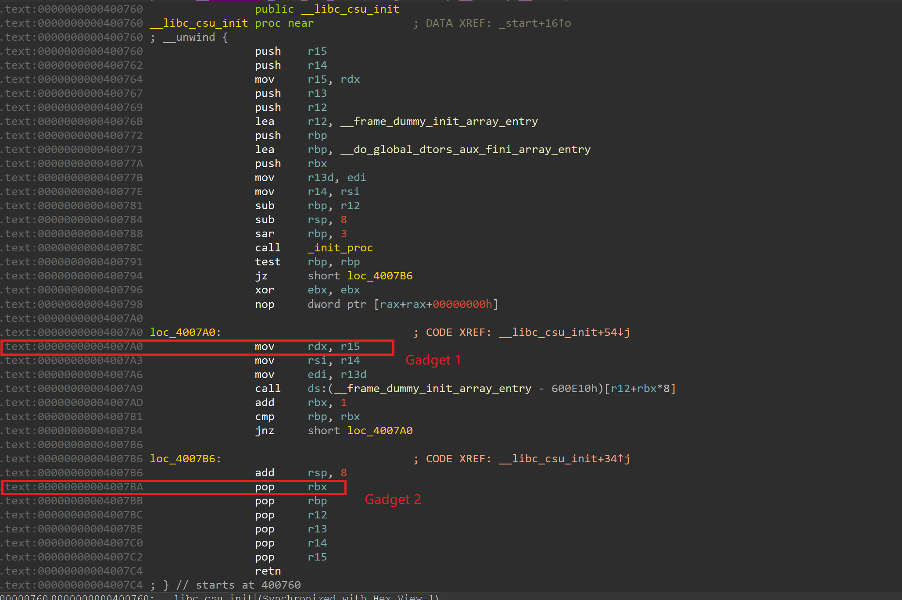
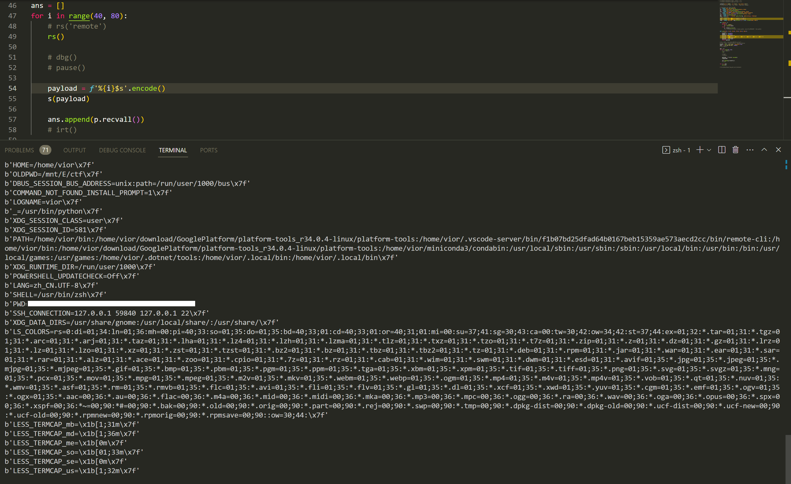
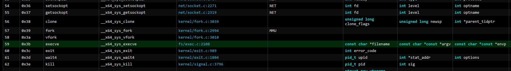
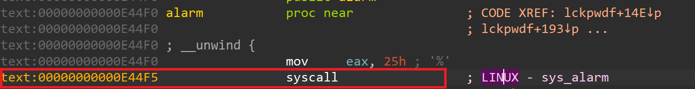
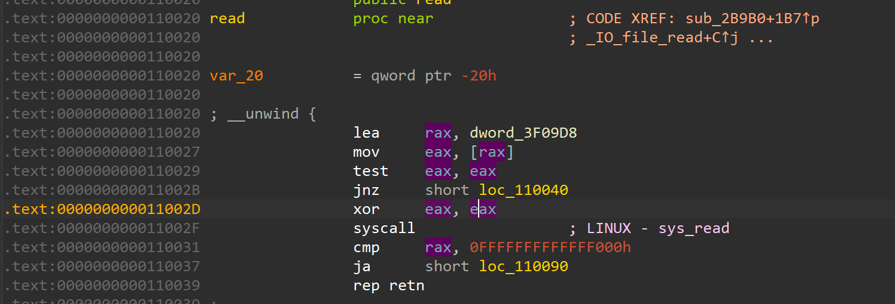
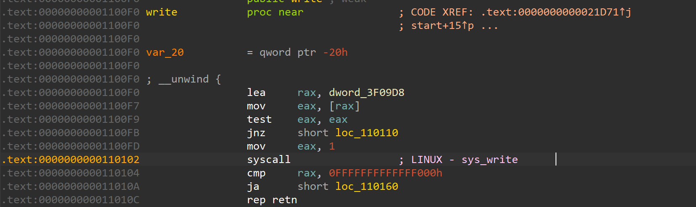

最近还在复建栈溢出，做点小笔记

今天重新学习了一下 Pwndbg 使用，CSU 构造模板，格式化字符串，ret2syscall，微偏移量 和 alarm 的知识

## Pwndbg 

### 常用指令

断点：b + func 符号，b + * + 函数地址

打印栈：stack + num

打印内存：x/(num)(x,d,s) + 内存地址; x 为16 进展，d 为整数，s 为字符串

单步步入：s

单步步过：n

运行到函数断点：c

## ret2csu

### 省流

常用 csu 模板：

```python
def csu(rdi=0, rsi=0, rdx=0, r12=0, rbx=0, rbp=1):
    # csu模板
    gadget_1 = 0x4007a0
    gadget_2 = 0x4007ba
    payload = p64(gadget_2)
    payload += (p64(rbx) + p64(rbp) + p64(r12) + p64(rdx) + p64(rsi) + p64(rdi))
    payload += p64(gadget_1)
    payload += b'b'*0x38
    return payload
```



### 原理

常用的 Gadget 通常只能操控个 rdi 和 rsi，而对于第三个参数 rdx 的操作一般由 ret2csu 这个技术来完成

使用 csu 模板不仅可以控制绝大部分寄存器，还能顺带操作一个调用（只能操控函数指针，所以一般用 got 表）

原理不细说，在 [ctf-wiki 中级rop](https://ctf-wiki.org/pwn/linux/user-mode/stackoverflow/x86/medium-rop/) 一文中有详细说明

### 缺点

csu 功能十分强大，也非常常见，但它也是有代价的。它所需要的 rop 空间往往非常大，其中大部分都消耗在了 `pop` 的操作上，往往不如 `Ropgadget` 寻找的小而美的 gadget

### 小技巧

#### 多次调用

这点在 ctf wiki 上也说过，只要单次大小满足 csu，往往可以用多次调用溢出点的方式利用 csu

#### 砍掉无用空间

如果你可以直接通过 csu 中的调用 get shell 或者 cat flag，那么你不用再关心调用后的 pop 传参，这一步可以省下大概 48 bytes 左右的栈空间 (8 * 6)，这个往往可以在部分地方结合着用


## 格式化字符串

### 省流

泄露栈内容用 `%xx$p.` , 得到地址后可以任意读

覆盖内容用 `%xx$n` , 需要保证栈上存在需要写入的地址，它可以由存在栈上我们的输入构造。这样可以做到任意写。为方便构造，我们一般用 `%hhn` 写入单字节来逐字节控制，`%hn` 可以控制双字，但是不常用

### 用处

一般来说单格式化字符串可以做到泄露基地址和 libc 地址的作用

如果有多次格式化字符串，可以在泄露基地址后将一些函数 got 地址改为 system，从而执行 system("/bin/sh")

### 小技巧

一般来说格式化字符串可以做到打印出绝大部分的栈内容，其中包含了程序名称，运行者名字，环境变量等。往往只需要一个格式化字符串就能将这些信息暴露出来。在部分 flag 在环境变量里的题目有奇效




## Ret2syscall

### 原理

syscall 是基本上最底层的调用，很多函数的本质就是 syscall，这里是 [syscall table](https://syscalls.mebeim.net/?table=x86/64/x64/v6.5)

其中最重要的是 0x3b，execve 的执行模式，该模式会运行给定字符串路径的程序，一般用它来运行 `/bin/sh` 从而 getshell，相当于运行 `execve("/bin/sh", 0, 0);`



要做到这个，需要将 rax 设置为 0x3b，其他三个参数设置为 "/bin/sh", 0, 0

设置其他参数可以用 csu 模板搞定，但是 rax 没那么容易，下面举一点利用的例子

### 控制 rax

#### 函数返回值

c 语言中有不少会返回非 0 数字的函数，其中有不少是可控的。比如 **read** 和 **write**，只要我们能**控制他们读入的字节数**，就能控制 rax

#### alarm 控制

也有一些特殊的方法能控制 rax，一个典型就是 **alarm 的计时控制**。如果上一个 alarm 计时没完成，又调用 alarm 创建新的计时，则 rax 会被改成上一个的剩下的时间

也就是说，我们只需要分时段调用 alarm 就能随意更改 rax 的值

[一些其他的 rax 控制方法](https://darkwing.moe/2019/06/24/Pwn%E5%AD%A6%E4%B9%A0%E7%AC%94%E8%AE%B021-%E5%85%B6%E4%BB%96%E4%B8%80%E4%BA%9B%E6%8A%80%E6%9C%AF/#%E8%AE%BE%E7%BD%AEEAX%E7%9A%84%E5%80%BC)

### 小技巧：微偏移量

在大部分题目中往往不会裸露的给出 syscall，而是会采取一些巧妙的方式来 ret2syscall

在部分 libc 里面会存在 syscall 离函数起始非常近的地方，而这些地方的地址相差往往不到 1bytes

这就导致了我们**不需要泄露 libc 地址**，也能控制其 got 表跳转到 syscall，仅仅只需要控制最低位的大小就行

其中最为典型的是 alarm，由下图所示



如果我们知道其最低位为 0xF5，我们仅需要把最低位由 0xF0 改为 0xF5 就可将 alarm 改为 syscall

如果题目没有给任何途径的泄露，libc 版本也没给的话，也可以用到这个技巧。仅需要**一字节的爆破**就能实现这个功能。

同样的，read 和 write 也可能可以这样利用，只需要存在微弱偏移就一般来说可以





## Reference

[CTF wiki 中级 ROP](https://ctf-wiki.org/pwn/linux/user-mode/stackoverflow/x86/medium-rop/#rop)

[pwn中的alarm函数——西湖击剑坐牢有感](http://www.blackbird.wang/2021/11/22/pwn%E4%B8%AD%E7%9A%84alarm%E5%87%BD%E6%95%B0%E2%80%94%E2%80%94%E8%A5%BF%E6%B9%96%E5%87%BB%E5%89%91%E5%9D%90%E7%89%A2%E6%9C%89%E6%84%9F/)

[syscall table](https://syscalls.mebeim.net/?table=x86/64/x64/v6.5)

好用工具：[libc table](https://libc.rip/)
