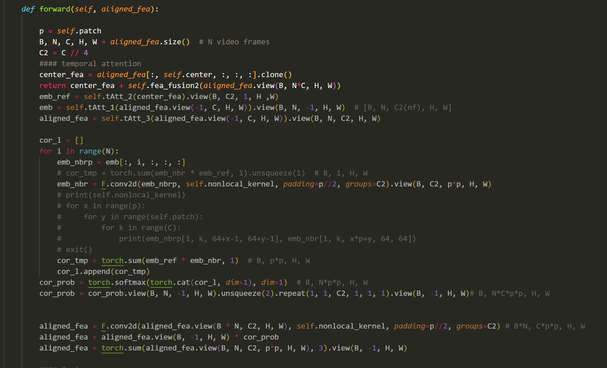

title: 对国内外科研现状的失望
author: vior
tags:

  - 随笔
categories:
  - write up
abbrlink: 12341234
date: 2023-12-15 07:24:00
---
## 对国内外科研现状的失望

个人的碎碎念

<!--more-->

### 前言

说在前面，我并不是一个资深的科研人员从业者。作为一个仅仅只是在科研门口浅尝辄止的人，光我触及到的科研现状就足以让人胆颤心惊。夸张的说，大部分科研成果，看着无比恢弘，但大部分只是一群草班台子撑着的一场戏罢了。除了少部分真正领域内的天才，其他人只是仰仗着组里积累的成果，小心翼翼的，生怕挤牙膏挤多了，一点点的将这个成果转化为论文。论文再来增加自己组的名声，以此来吸引更多慕名而来的新人。若是运气很好请到了个大佬，便成为组里的又一大主力，持续不断地生产着论文。

学术研究，已经从研究转为了论文印刷机。我很不喜欢这样子

### 学术制度的缺陷

​	*各位同学们，在本书的开始，我不得不遗憾地告诉大家一个消息。国内绝大部分大学的本科教学，不是濒临崩溃，而是早已崩溃。在此，我无意争论是否复旦、中科大、或者清华、北大是否比我们崩溃的更少一些——这种争论是没有意义的。我只是看到了无数充满求知欲、激情、与年轻梦想的同学们，将要把自己的四年青春，充满希望与信任地交给大学来塑造。这使我心中非常不安。*

可以这么说，这些问题的一大部分都要归咎于这个教育体系。这倒不是说这个教育体系是最糟糕的，就如同资本市场体制一样。它能带来创新和进步，但代价是大部分科研人员的压力与痛苦。计划经济无法，或者说很难正确的进行优秀产业的升级，其原因之一就是企业的创新度和真正的价值难以衡量。相对而言，市场经济让更能赚钱的企业活得更好，那么赚钱，也是资本是整个企业努力的方向。为了实现这个方向，科技往往也能得到创新，产业也能得到升级。但是也会有副作用，金融和虚拟经济也得益于此，但这里就不展开了

和市场经济类似，学术界需要一个大家一起努力的方向，最好是可以量化的。那么，论文就是那个最好的指标。有了论文，你在学术界做很多事情都可以迎刃而解。有论文，申 phd 有巨大的帮助，以后申教职，留校任教，找工作，你的论文都可以说是你的硬实力的一部分。

但是，我们真的能用论文数衡量一个人的实力吗？诚然，一个人的高质量的论文论文数，应该是和他的硬实力是正相关的。但大部分人可能并不具备如此高超的能力，或者说，很难在短期内取得大量高质量的成果，那么这个时候一些操作就应运而生了。

首先，是一些所谓的祖传项目。一些科研组垄断部分特殊方向的论文，将成果以挤牙膏的方式分批放出。一个论文的成果就够发好几篇。评上后没个两三年不公布代码，或者索性“忘了”公开。这是其一

其二，是部分学术造假。注意，这里所说的不是结果和大部分内容存在造假。但是这个现象十分的普遍。甚至在一些顶级刊物都存在。不过，级别越高，造假程度应该会越小。举个例子就是说部分功能我在我的论文中并没有实现，但并不妨碍我添油加醋的在论文中写上我“理想中的效果”。毕竟大部分人不会真的去深扒代码，看看到底实现了吗？

其实，最重要的还是。这样的制度很可能会摧毁一个人的热情。可能部分人会把对这个领域，对这个方向的热爱和激情投入到论文产出中，以此来循环激励自己。但这样的情况不多见，而且难以为继。

关于学术界的情况，可以参考一下这个视频：[Is Academia a Ponzi Scheme?](https://www.youtube.com/watch?v=WsMUrW1PbxQ)

### 一些例子

#### 安全研究，一篇发布在 *ACM SIGSAC* 做浏览器隐私相关研究的论文

文中的主要内容是在详细阐述一个自己提出的浏览器沙盒框架，根据一些现有的问题来做的更加合理的一个浏览器隐私模式处理流程。这里的大部分内容没啥问题

但在这之前，它提出过另一个用于检测浏览器问题的自研工具，阐述了他的功能，用法和原理。但实际去看他的代码会发现它根本没有实现完全。是基本跑不起来的。没有如何使用的说明也没有东西介绍

我推测后面所谓的自动发现的“漏洞”也是人工挖的。但为了写论文还是说是通过自己写的程序发现的

#### CV，视频压缩领域， CVPR 顶会上的一篇论文

文章中描述自己的神经网络架构使用了一个 *非局部注意力模块（Nonlocal Attention fusion module）*，但在翻代码时会发现 fusion 模块根本没有被调用到。甚至网络架构代码还未完工，基本无法使用。

虽然该文章没有使用这个模块就实现了更好的性能，但是他将这个的一部分成果归功于这个完全没有被调用的模块，也算是有失偏颇

### 个人想法

​	*不少同学之所以进实验室做研究是为了出国。他们甚至明目张胆地说自己不喜欢也不适合做研究。这种为了出国而做研究的想法本末倒置，是非常错误的。出国念书的核心目的，本应是为了争取一个更好的做研究的环境。对于一个不适合做研究的人而言，花五六年甚至更长时间读博士，那就像坐牢一样痛苦！我认识好几名同学，他们在本科的时候信誓旦旦地要投身科学事业，但是真正坐在实验室里，不到一年就坐不住了。最后只拿硕士学位就匆匆走人。我很想告诫这类同学：费尽心思把自己往 PhD 的火坑里推，是一件可悲而且可怕事情！*

可能学术界，很久以来就是这个样子。感觉没啥意思，如果这个不会影响到我的话我也不会有什么怨言。但在这个经济下行的大环境下，越来越多的人涌入研究领域，卷到研究生还不过瘾，还要去卷博士生。人数越多的同时，竞争也会越大。然而教职资源一直都是有限的，这样卷的后果就是论文数的水涨船高，和投递论文的难度上升。可能这一部分也要归功于大量 AI 论文灌水。不过根本原因，还是这个不够理想的学术界制度不够好罢了。

唉，我身边的一些没有学术追求的人都开始卷博士了。感觉很像高考后本来想读其他专业的同学，都一股脑的涌入计算机领域一样。最后，我应该还是不会走上学术道路。不知道未来会是怎么样呢？这里引用上海交通大学生存手册的一段话

### 做研究的兴趣 [ref](https://survivesjtu.gitbook.io/survivesjtumanual/li-zhi-pian/zuo-yan-jiu-de-xing-qu)

当你站在巨人的肩膀上，开始进行独立研究的时候，你最需要的，是兴趣。不要说，“有研究经历好出国”，不要说“没什么其他好出路所以选择做研究”。浩然高科技大楼下的白骨告诉我们，没有兴趣的徒劳坚持通常是很危险的。在科研这条道路上，只有对一门学科的喜爱，才能成为你唯一和全部的动力。这个喜爱不应当是抽象的，喜欢某门学科和喜欢某项运动从道理上很相似：比如你说喜欢篮球，你一定不会是因为看到那个球在地上滚就觉得很兴奋，而是因为你对篮球作为一项竞技运动有足够的了解，所以才喜欢打，或者喜欢看篮球。喜欢一个学科也是一样，无知的兴趣一定是苍白的。

走进一个学科之前，最先应该知道的是该学科的研究对象、研究方法，以及当前研究中的热点难点问题，而不应该被广告一样的花哨演示糊弄住。

开始搞研究，并不必然意味着你要和学校里一个实验室有行政上的关系。真正扎实的认识应当是从阅读和学习中开始的。你可以试着去看这个学科最新的影印版教科书。（顺便说一下，在绝大多数高新技术领域，对于教科书的选择，我们能接受的下限是外文作者的中文翻译。尝试阅读所谓国内专家的专著只会让你的思维变得更为混乱）如果在大致看完这些书籍之后，你还能保持之前的热情，那么我非常鼓励你尝试进入该方向进行更深入的研究。

如果去做研究，那么你从一开始就应该期望着自己能够做出影响到其他科研工作者的原创性工作。绝对不要随便跑到研究小组里给人端茶倒水，指望着通过打杂来获得一段所谓的“研究经历”，或者是一篇文章第N作者的署名权。在研究过程中，相关知识不够没关系，数学不好也没关系；但是无论如何，你需要保持一个独立思考的心态。如果有好一点的工作，可以发牛一点的文章；价值略低的工作也有名气小些的出版物可以发表。但归根结底，发表文章需要的是你的原创性思考。至于那些一年上百篇论文的高产教授和一年数十篇论文的高产学生们。我们只能很遗憾地说，他们的工作是不值一提的垃圾，这种人的存在，简直就是丢中国人的脸。

