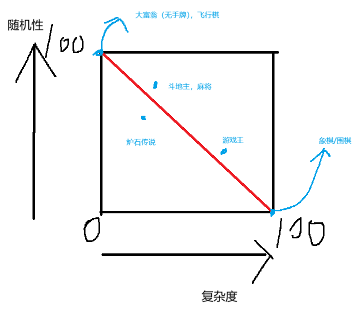
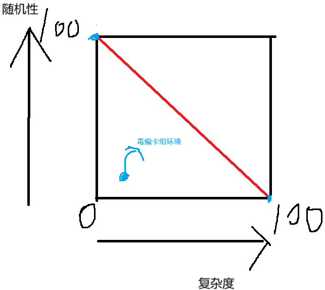
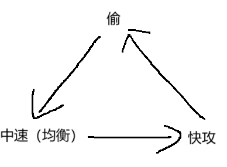
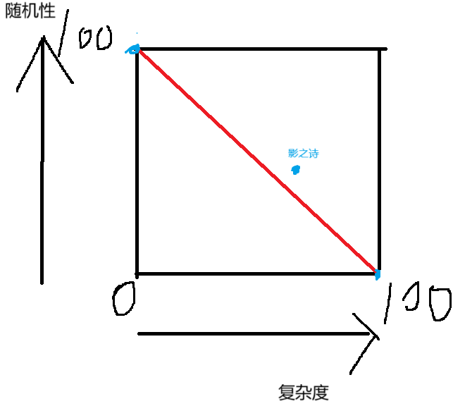

## 棋牌类游戏的概率，复杂度与受众和游戏性的平衡

### 总定义

这里对棋牌类游戏的定义包含传统棋牌（象棋，麻将，斗地主），网游类棋牌（炉石传说，影之诗，游戏王），单机类棋牌（杀戮尖塔 like）

就我个人而言，所有的棋牌游戏玩的其实是对局的新鲜感，这个新鲜感来源于局面的复杂度（如象棋围棋）和随机性（如斗地主，麻将）。若一个游戏无法带来复杂或随机的局面，它就很容易腻。游戏寿命也非常的短

<!--more-->

观察大部分游戏寿命比较长的游戏，复杂度和随机性往往成负相关，然后游戏的难度/竞技性与复杂度为正相关，这就导致了受众人数其实是与随机性呈一定程度的正相关。也就是说，在一个合理的范围内，大家往往喜欢简单并随机的游戏。但是这两者也需要取得一些平衡 （ps，这边的复杂度只指场景变化，方案选择之类的游戏性的策略深度，不包含字面意思的复杂度如：游戏规则的复杂性之类）

如果将大部分棋牌游戏评个分的话，横纵轴分别为对于复杂度和随机性 0 ~ 100 的评分，我简单画出下面的图像

红线是长寿命棋牌游戏与随机性和复杂度的相关函数，大部分游戏都在这个线的上下波动。寿命长的游戏不可能随机性和复杂度都非常低，因为这无法给玩家带来新鲜感。寿命短的游戏也不可能复杂度和随机性都特别高，因为高度的随机会使得游戏缺少竞技性，同时过高的复杂度也让大部分玩家流失，这就导致无论是硬核玩家还是大众玩家都无法接受这种类型的游戏

下面我将分析几个例子，完全复杂的棋牌游戏（象棋围棋），完全随机的棋牌游戏（大富翁/飞行棋），以及处在中间对两侧有略微倾向的其他游戏

### 完全复杂的例子：国际象棋

国际象棋的变化来源于棋子的排列，因为人力无法计算全部的深度和情况，所以大部分人下的棋局都是千奇百怪和较为独特的，这也是它的乐趣所在：对抗双方玩家的思维深度（在差不多棋谱水平的情况下）

但国象这种没有随机性的游戏，就会无可避免的带来固定开局和定式，也就是背谱。这就造成了较高的学习成本。在还没背完开局就上手的情况下，往往会导致新手在还未进入展现思维深度的中局时，就进入了败式的残局。可以说，所有的没有随机性且具有群众基础的游戏，都需要背谱才能有充足的游戏体验（这边仅讨论该游戏的核心玩家群体）

### 完全随机的例子：无手牌无随机事件大富翁/飞行棋

之前想了很久都没找到完全随机的例子，但我后面发现原始桌游大富翁其实应该符合这个要求。这种游戏的特征就很明显：简单且随机，没有任何上手门槛也能带来新鲜感。不过我也承认这种游戏的寿命还是难以和象棋，斗地主这种国民游戏相提并论的，这边只是作为一个简单的例子讨论一下

其实也没啥好说的。这种游戏就是投骰子走格子，各玩各的纯看脸。作为大众消磨时间用的游戏，也算是有点群众基础且无门槛的游戏

### 麻将（复杂度低，随机性高）

麻将在我看来是典型的随机性大于复杂性的游戏（这边仅讨论日麻，不讨论其他麻将），但其实它的策略深度不算很低。它的操作方向主要在于操纵期望，通过高质量摸切和避铳使得整体分数期望回升。但是这种操作只能在长时间的情况下（大数定理）才能凸显它的竞技性，在短时间内它依然是一个随机性占主导的棋牌游戏。

### 炉石传说（复杂度略低，随机性略高）

炉石算是非传统棋牌类游戏的 top 了，他也是个在我看来变化比较大的棋牌游戏。作为现代类棋牌游戏，它这游戏的风格也在每个版本都在变化。但依我看，它算是个随机性略大于复杂度的游戏

就像象棋和围棋一样，炉石的大部分卡组也算是有个固定的步骤，不过这种步骤是会受到随机性影响的。也就是说，虽然这个卡组有一套相对固定的流程，但是由于对手的不同和随机性的变化，每个游戏对局都会给玩家带来较强的新鲜感。但是这种平衡非常难以调节，随着时间的发展，总有部分最优解会被发掘出来，从而导致了环境的恶化和对局的固定。这可以用上文的图来表示

毒瘤卡组往往具有高稳定性，高强度和易上手的特性，这会导致游戏收敛到如图所示的位置，因为：高稳定性（随机可控，随机性下降），高强度（能打爆其他大部分卡组，导致除毒瘤卡组外无生存土壤，环境中充满该卡组导致整个游戏变成毒瘤卡组的温床），易上手（不复杂，起码不会像下棋一般复杂，复杂度的上限一般是由游戏本身决定的）

这边偏个题，一个相对稳定的卡牌游戏环境往往会在快攻，中速（正常发展）和慢速（偷，梭哈发展）中找到个平衡。这是理想情况

但其实炉石不太符合这个条件也能平衡，因为炉石的概率成分还是相当高的，只要手气好基本都能打。

然后炉石就说的差不多了

### 影之诗（复杂度略高，随机性略低）

关于影之诗，它从游戏性上和炉石其实差不多，但是在底层逻辑上区别其实挺大的。这也就导致了它其实算是个复杂度略高，概率性略低的一个游戏

影之诗的核心体系在于任务，它的每个角色都有单独一套类似的任务体系，而且可控随机其实相对算多（任务体系卡都比较类似）导致随机性会比炉石低一些，而且复杂度略高主要来源于残局的计算。部分影之诗对局的极端情况可能不亚于象棋残局的计算量。并且流程也相对固定。相比于炉石就稍微更像下棋一样

影之诗的卡组就比较遵循上面的 慢速（偷）——中速——快攻的三角，快攻 4，5费做完任务，中速 6，7费。慢速（通常是控制卡组）要7费以及以后才能做完。但是成型的强度就是 慢>中>快。以至于影之诗的游戏就是一直在和上面三个平衡的稀泥。不同于炉石，它的卡组算是有比较明显的克制关系

影之诗的环境其实也挺有意思的，称为环境的自适应机制。如果上面的三角有一角失衡，就会导致另外一边卡组的使用率提升，或者全环境针对这卡组（包括内战）导致一个奇怪的动态平衡。但也会有毒瘤卡组的出现导致退化成极端情况

好那这就差不多是复杂度略高，随机性略低的情况

### 游戏王（复杂度高，随机性低）

这边叠个甲，我仅仅只是游戏王一个可能还没入门的萌新，关于这个的解读只是我的个人不成熟的想法罢了，求轻喷

游戏王在我眼里可能只是一个带有版本更新和开局随机性的新型棋类游戏，它的随机性其实挺低的基本只有开局和抽卡的随机。相比于炉石和麻将的随机主导，游戏王除开极端情况外就是展开一波或者两波的事。流程需要背且上手门槛不低，这个流程甚至能在对手的回合也能展开，还是挺厉害的

游戏王有个核心机制是动点，也就是展开的关键节点。基本只要关键组件到手就能按流程展开，且动点也能存在于对面的回合

总的来说，游戏王流程固定，随机性不高，见招拆招且上手门槛高。我认为他是一个复杂度高，随机性低的棋牌游戏

那这些其实就算是我对目前的大部分棋牌类游戏的看法，图片表格不严谨仅仅图一乐