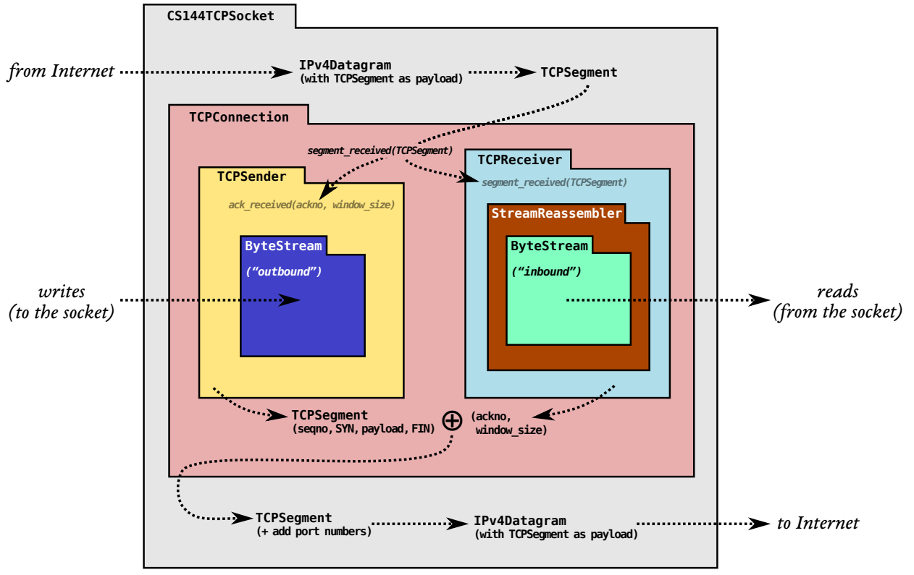
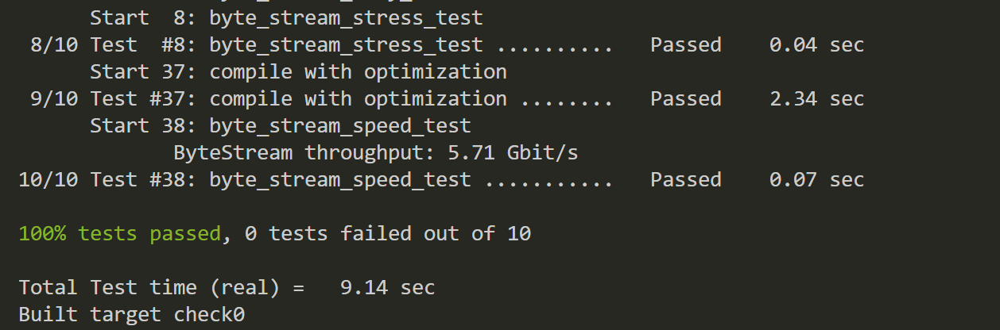

# CS144 Lab 0: 
git clone https://github.com/cs144/minnow
CS144 lab 0 分别有两部分 task
task 1 是用命令行工具和调库来实现对 http 协议的仿真
task 2 是实现 socket 底层的 byteStream, 用于暂存接收数据


## Task 1
要求用 TCPSocket 和 ADDRESS 实现，搜了下发现是 socket.h 的库
直接样样例掉包不到 10 行，[doc](https://cs144.github.io/doc/lab0/class_t_c_p_socket.html#a7a50427a401d1a6f3209d51818bad901)
```c++
TCPSocket sock;
sock.connect( Address(host, "http") );
sock.write( "GET " + path + " HTTP/1.1\r\n" + 
              "Host: " + host + "\r\n");
sock.write( "Connection: close\r\n\r\n" );
while (!sock.eof())
{
  string tmp;
  sock.read(tmp);
  cout << tmp;
}
sock.close();
```
```bash
100% tests passed, 0 tests failed out of 2

Total Test time (real) =   6.20 sec
Built target check_webget
```
流程就参考之前命令行的操作
## Task2
写个双向队列的 buffer
	最开始是想用 deque 写的，但是他在大数据的时候会出现 x00 的阶段，具体原因在下面写好了
	最后改用头尾指针 vector 加 resize 来实现
主要代码是写基于 ByteStream 这个父类的两个子类

### Writer
#### push( std::string *data* )
传入 byte，不需要考虑顺序是否合法，只需要装入即可
#### close()
close 设置 close 参数，注意这和结束不同。结束的要求是 close flag 为 true 的情况下还得清空 bytestream size
#### 其他
很简单就不写了
### Reader
#### string_view Reader::peek() const
读取字符串，但记得返回 string_view 格式
#### *void* Reader::pop( uint64_t *len* )
就是 pop，不过记得处理异常状态
### 写 C++ 的一些疑问
但是 c++ 类的继承，继承后的变量共享吗？🤔
如果是 public 就会是共享的，而不是赋值。如果是其他的就是有其他的情况

| 访问     | public | protected | private |
| -------- | ------ | --------- | ------- |
| 同一个类 | yes    | yes       | yes     |
| 派生类   | yes    | yes       | no      |
| 外部的类 | yes    | no        | no      |

#### 为啥 C++ bool 赋值可以用 {} ？

*bool* error_ {};
不过确实是默认赋值
应该只是个初始化吧，可能没什么特殊意义

#### 关于 explicit 关键字

explicit  是隐式调用，用于单变量输入的，大概意思就是规范传参
可以参考这篇 https://cloud.tencent.com/developer/article/1900901
还有就是如果要实现传参的 init 需要在 class 内部定义一个同名结构

### 坑：
在压力测试下，有样例会返回 x00
```
*__** Unsuccessful Expectation: peek() gives exactly "\x1aCh>EXj:<\x03e\x17@\x0aIV%" __***
ExpectationViolation: Expected exactly "x1aCh>EXj:<x03ex17@x0aIV%" at front of stream, but found "x1aCh>EXj:<x03ex17@x00x00x00x00"
```
啊，抽象，貌似 C++ 里的 deque 并不完全内存连续（在多次写入后会在新地区开新内存），但是 lab 又是只要求 string_view 返回，导致 string_view 的内容有问题（因为它只存地址和偏移）。当多次调用 deque push 和 pop 后，deque 在新开内存会导致内存不连续，进而导致 string_view 内容会存在 \0x00 的溢出。
这就很操蛋了。因为如果我用传统方法在局部函数内构造中间值的话会在退出函数时被栈更新覆盖，导致只有指针的 string_view 返回栈上的野指针。但是由于  lab 要求我又不能开 malloc 和全局变量，可能他觉得不安全。逆天
最后还是得用 vector 手搓双指针队列
{:height 246, :width 719}

### byte_stream.hh
```c++
#pragma once

#include <cstdint>
#include <iostream>
#include <vector> 
#include <string>
#include <string_view>

class Reader;
class Writer;

class ByteStream
{
public:
  explicit ByteStream( uint64_t capacity )
  {
    _capacity = capacity;
    _buffer.resize(_vector_size);
  };

  std::vector<char> _buffer = {};
  bool _close = false;
  bool _finish = false;
  uint64_t _bytes_pushed = 0;
  uint64_t _bytes_popped = 0;
  uint64_t _size = 0;
  uint64_t _update_flag = 0;
  uint64_t _vector_size = 0xffffff;
  
  uint64_t _head = 0;
  uint64_t _tail = 0;
  // Helper functions (provided) to access the ByteStream's Reader and Writer interfaces
  Reader& reader();
  const Reader& reader() const;
  Writer& writer();
  const Writer& writer() const;


  void set_error() { _error = true; };       // Signal that the stream suffered an error.
  bool has_error() const { return _error; }; // Has the stream had an error?

protected:
  // Please add any additional state to the ByteStream here, and not to the Writer and Reader interfaces.
  uint64_t _capacity = 0;
  bool _error = false;
};

class Writer : public ByteStream
{
public:
  void push( std::string data ); // Push data to stream, but only as much as available capacity allows.
  void close();                  // Signal that the stream has reached its ending. Nothing more will be written.

  bool is_closed() const;              // Has the stream been closed?
  uint64_t available_capacity() const; // How many bytes can be pushed to the stream right now?
  uint64_t bytes_pushed() const;       // Total number of bytes cumulatively pushed to the stream
};

class Reader : public ByteStream
{
public:
  std::string_view peek() const; // Peek at the next bytes in the buffer
  void pop( uint64_t len );      // Remove `len` bytes from the buffer

  bool is_finished() const;        // Is the stream finished (closed and fully popped)?
  uint64_t bytes_buffered() const; // Number of bytes currently buffered (pushed and not popped)
  uint64_t bytes_popped() const;   // Total number of bytes cumulatively popped from stream
};

/*
 * read: A (provided) helper function thats peeks and pops up to `len` bytes
 * from a ByteStream Reader into a string;
 */
void read( Reader& reader, uint64_t len, std::string& out );

```
### byte_stream.cc
```c++
#include "byte_stream.hh"
#include <iostream>
#include <vector> 

using namespace std;

bool Writer::is_closed() const
{
  return _close;
}

void Writer::push( string data )
{
  uint64_t len = data.size();
  if ( len > Writer::available_capacity() )
  {
    len = Writer::available_capacity();
  }
  _bytes_pushed += len;
  _update_flag += len;
  _size += len;
  if (_update_flag > _vector_size)
  {
    int tmphead = 0;
    for(size_t i = _tail; i < _head; i++)
    {
      _buffer[tmphead] = _buffer[_tail];
      tmphead++;
      _tail++;
    }
    _tail = 0;
    _head = tmphead;
    _update_flag = len;
  }
  for (size_t i = 0; i < len; i++) {
    _buffer[_head] = data[i];
    _head++;
  }
  return;
}

void Writer::close()
{
  _close = true;
  if (_size == 0)
    _finish = true;
  return;
}

uint64_t Writer::available_capacity() const
{
  return _capacity - _size;
}

uint64_t Writer::bytes_pushed() const
{
  return _bytes_pushed;
}

bool Reader::is_finished() const
{
  return _finish;
}

uint64_t Reader::bytes_popped() const
{
  return _bytes_popped;
}

string_view Reader::peek() const
{
  string_view tmp = string_view( &(_buffer[_tail]), _size );
  return tmp;
}

void Reader::pop( uint64_t len )
{
  if ( len > Reader::bytes_buffered() )
  {
    set_error();
    return;
  }
  _bytes_popped += len;
  _size -= len;
  _tail += len;
  
  if (!_size && _close)
    _finish = true;

  return;
}

uint64_t Reader::bytes_buffered() const
{
  return _size;
}

```
