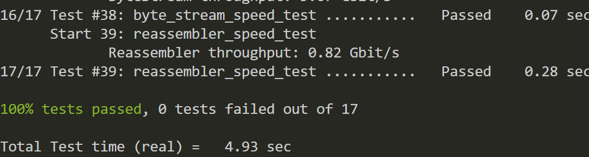

# CS144 Lab 1 Stream Reassembler : 
实现 stream Reassembler 流组装器，也就是流重组器
{:height 480, :width 750}
不同协议的 ack 收发方式不同，在这边默认是 ack 乱序收发，这里关系不大。只是需要把在空间内能存的存了。但是如果卡了一个包没收那就不能收了

<!--more-->

## Reassembler
#### *void* Reassembler::insert( uint64_t *first_index*, string *data*, *bool* *is_last_substring* )

插入 byte，这个在处理一些长度是很麻烦。（因为长度超过 capacity 就会丢弃）

### 一些问题
#### 左值引用和右值引用是啥？

explicit Reassembler( ByteStream&& *output* ) : output_( std::move( *output* ) )
在实际场景中，右值引用和std::move被广泛用于在STL和自定义类中**实现移动语义，避免拷贝，从而提升程序性能**。 在没有右值引用之前，一个简单的数组类通常实现如下，有`构造函数`、`拷贝构造函数`、`赋值运算符重载`、`析构函数`等。深拷贝/浅拷贝在此不做讲解。
一句话总结右值引用：**可移动对象在<需要拷贝且被拷贝者之后不再被需要>的场景，建议使用**`std::move`**触发移动语义，提升性能。**
example:

```c++
template<typename T>
void func(T& param) {
    cout << "传入的是左值" << endl;
}
template<typename T>
void func(T&& param) {
    cout << "传入的是右值" << endl;
}

int main() {
    int num = 2019;
    func(num);
    func(2019);
    return 0;
}

```
{:height 208, :width 749}
### reassembler.cc
```c++
#include "reassembler.hh"
#include <iostream>

using namespace std;

void Reassembler::insert( uint64_t first_index, string data, bool is_last_substring )
{
  bool write_flag = false;
  uint64_t capacity = output_.writer().available_capacity();

  if (first_index + data.size() - _offset >= _reasse_vector_size)
  {  
    buffer_update();
  }

  for(uint64_t i = 0; i < data.size(); i++)
  {
    // 如果即将 push 的超过 buffer 的大小，则直接丢弃
    if (capacity == 0)
      break;
    // 排除负数情况
    if (i + first_index < _check_index)
      continue;
    // 如果长度超过 capacity 则退出       
    if (i + first_index - _check_index >= output_.writer().available_capacity() && i + first_index >= _check_index)
    {
      break;
    }
    if (!_index_checker[i + first_index - _offset])
    {
      capacity--;
      _buffer[i + first_index - _offset] = data[i];
      _index_checker[i + first_index - _offset] = true;
      _reassemble_size++;
      
    }

    if (i + first_index == _check_index)
    {
      write_flag = true;
    }
  }

  if (write_flag)
  {  
    write_to_output();
  }

  if (is_last_substring)
  {
    _end_index = first_index + data.size();
  }
  
  if (_end_index == _check_index)
  {
    output_.writer().close();
  }
  
}

uint64_t Reassembler::bytes_pending() const
{
  return _reassemble_size;
}

void Reassembler::buffer_update() 
{
  _offset = _check_index;
  for(uint64_t i = 0; i < _reasse_vector_size; i++)
  {
    _index_checker[i] = false;
  }

  for(uint64_t i = _check_index; i < _reasse_vector_size; i++)
  {
    _index_checker[i - _check_index] = _index_checker[i];
    _buffer[i - _check_index] = _buffer[i];
  }

}

void Reassembler::write_to_output()
{
  string tmp {};
  uint64_t tmp_size = output_.writer().available_capacity();

  for(uint64_t i = _check_index; _index_checker[i - _offset] ; i++)
  {
    if (tmp_size == 0) 
      break;
    
    tmp += _buffer[i - _offset];
    _check_index++;
    _reassemble_size--;
    tmp_size--;
  }
  output_.writer().push(tmp);
}

```
### reassembler.hh
```c++
#pragma once

#include "byte_stream.hh"
#include <vector>
#include <iostream>

#define _reasse_vector_size 152548
class Reassembler
{
public:
  // Construct Reassembler to write into given ByteStream.
  explicit Reassembler( ByteStream&& output ) : output_( std::move( output ) ) {
    _buffer.resize(_reasse_vector_size);
  }

  /*
   * Insert a new substring to be reassembled into a ByteStream.
   *   `first_index`: the index of the first byte of the substring
   *   `data`: the substring itself
   *   `is_last_substring`: this substring represents the end of the stream
   *   `output`: a mutable reference to the Writer
   *
   * The Reassembler's job is to reassemble the indexed substrings (possibly out-of-order
   * and possibly overlapping) back into the original ByteStream. As soon as the Reassembler
   * learns the next byte in the stream, it should write it to the output.
   *
   * If the Reassembler learns about bytes that fit within the stream's available capacity
   * but can't yet be written (because earlier bytes remain unknown), it should store them
   * internally until the gaps are filled in.
   *
   * The Reassembler should discard any bytes that lie beyond the stream's available capacity
   * (i.e., bytes that couldn't be written even if earlier gaps get filled in).
   *
   * The Reassembler should close the stream after writing the last byte.
   */
  void insert( uint64_t first_index, std::string data, bool is_last_substring );

  // How many bytes are stored in the Reassembler itself?
  uint64_t bytes_pending() const;

  // Access output stream reader
  Reader& reader() { return output_.reader(); }
  const Reader& reader() const { return output_.reader(); }

  // Access output stream writer, but const-only (can't write from outside)
  const Writer& writer() const { return output_.writer(); }

  uint64_t _check_index = 0;
  
private:
  ByteStream output_; // the Reassembler writes to this ByteStream

  uint64_t _reassemble_size = 0;
  uint64_t _offset = 0;
  uint64_t _end_index = 0xffffffff;

  bool _index_checker[_reasse_vector_size] {0};
  std::vector<char> _buffer {};

  void write_to_output();
  void buffer_update();
};

```
