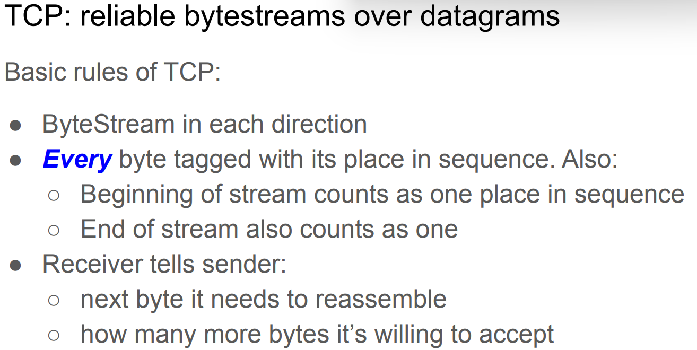
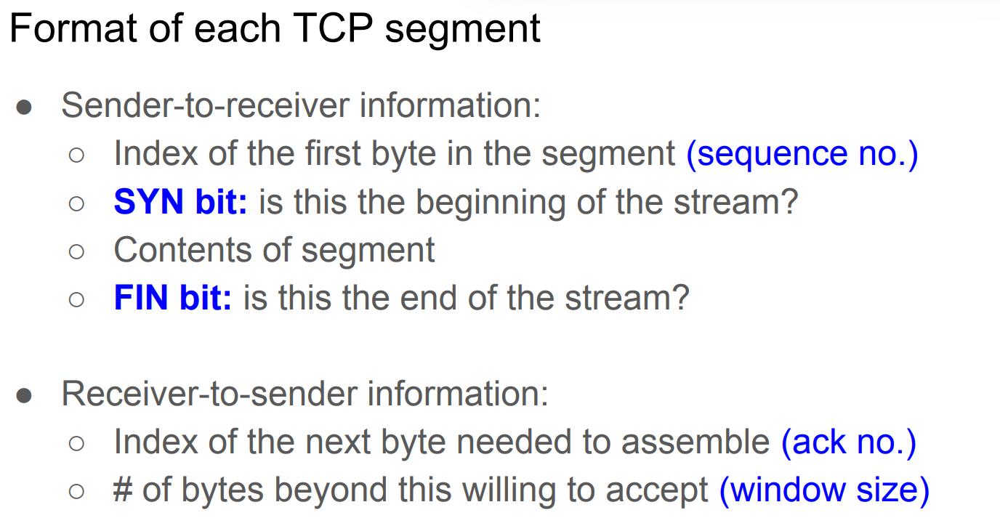
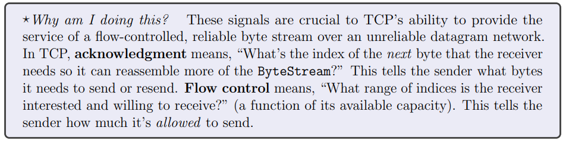
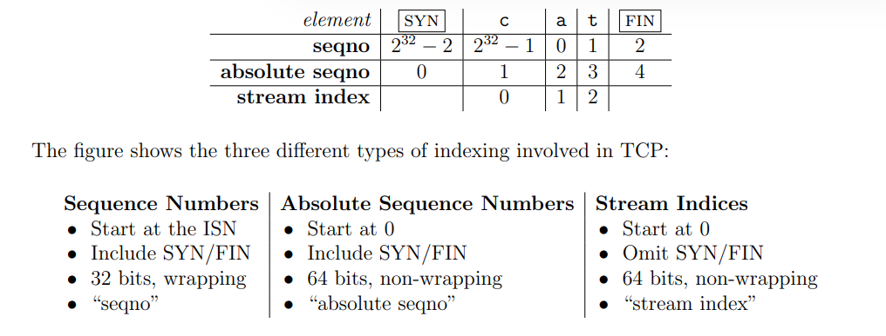
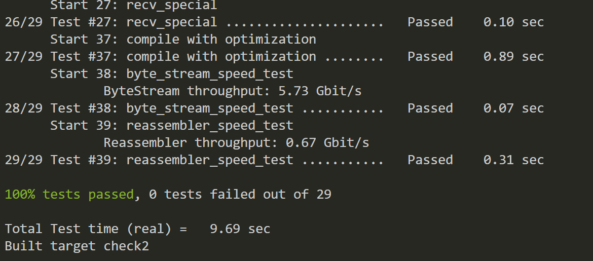

# CS144 lab 2 Receiver


实现 tcp receiver 和 Wrap32

<!--more-->

## Wrap32
因为 tcp 中的字节数很宝贵，也可能是当时的时代局限。导致 ackno 的字节数只占 32 bits，为了使其适应 64 bits 和一些其他目的，要编写 Wrap 32 这个结构体
#### Wrap32 Wrap32::wrap( uint64_t *n*, Wrap32 *zero_point* )

64 位转成 32 位
zero_point 指初始 SYN 的 ack 序号，因为它是随意的。但单论我们这次 tcp 连接中它是逻辑上的 0，也就是下面的 absolute seqno，因此 wrap 也是 seqno 转 absolute seqno 的 function

#### uint64_t Wrap32::unwrap( Wrap32 *zero_point*, uint64_t *checkpoint* ) const

32 转 64 位，但是高 32 位有很多种可能，信息是有损的。所以我们需要一个 64 位的参照物也就是 checkpoint，32 位转 64 位的结果要尽可能接近该 checkpoint

## Receiver


### 功能：
需要发送给接收方 ACK 和 Window Size
需要接受数据，其中包含了三个序列
Sequence Number, Absolute Sequence Number, Stream Indices
虽然看起来麻烦，但是发现 lab2 只要调自己写的包就行。感觉之前写的健壮性如此之高的代码终于有用了。很多东西只要一股脑的塞给流组装器就行。不用考虑太多，主要就是处理 index 转换

### 代码
#### *void* TCPReceiver::receive( TCPSenderMessage *message* )
需要做一些特殊判断，判断后直接丢进 reassembler 就完事了
#### optional<Wrap32> TCPReceiver::ackno() const

实际上就发缺的 ackno，或者最新 byte index + 1

#### size_t TCPReceiver::window_size() const

直接 this->reassembler().writer().available_capacity() 完事
记得判断最大值

### tcp_receiver.cc
```c++
#include "tcp_receiver.hh"
#include <iostream>

using namespace std;

void TCPReceiver::receive( TCPSenderMessage message )
{
  if (message.RST)
  {
    this->reader().set_error();
    return;
  }

  if (this->synsent_ == false)
  {
    if (!message.SYN)
    {
      return;
    }
    this->synsent_ = true;
    this->zero_pointer = message.seqno;
  }

  if (message.FIN)
  {
    this->finsent_ = true;
  }
  
  uint64_t curr_abs_seqno = message.seqno.unwrap(this->zero_pointer, this->reassembler().writer().bytes_pushed() + 1);
  int64_t stream_index = 0;
  if (!message.SYN)
    stream_index = curr_abs_seqno - 1;

  //boder check
  if (stream_index < 0)
    return;
  this->reassembler_.insert(stream_index, message.payload, message.FIN);

}

optional<Wrap32> TCPReceiver::ackno() const
{
  // 获取发出的 ack （FIN, SYN 之类的长度也算在内）
  Wrap32 ret = Wrap32(0);
  if (this->synsent_ == false)
    return nullopt;
    
  ret = this->zero_pointer.wrap(this->reassembler()._check_index + 1, this->zero_pointer);

  if (this->reassembler().writer().is_closed())
    ret = ret.wrap(1, ret);

  return optional<Wrap32>(ret);
}

size_t TCPReceiver::window_size() const
{
  uint32_t res = this->reassembler().writer().available_capacity();
  if (res >= 65535)
    return 65535;
  return res;
}

TCPReceiverMessage TCPReceiver::send() const
{
  TCPReceiverMessage ret;
  ret.ackno = this->ackno();
  ret.window_size = this->window_size();
  ret.RST = this->reader().has_error();
  
  return ret;
}

```
### tcp_receiver.hh
```c++
#pragma once

#include "reassembler.hh"
#include "tcp_receiver_message.hh"
#include "tcp_sender_message.hh"

class TCPReceiver
{
public:
  // Construct with given Reassembler
  explicit TCPReceiver( Reassembler&& reassembler ) : reassembler_( std::move( reassembler ) ) {}

  /*
   * The TCPReceiver receives TCPSenderMessages, inserting their payload into the Reassembler
   * at the correct stream index.
   */
  void receive( TCPSenderMessage message );

  // The TCPReceiver sends TCPReceiverMessages to the peer's TCPSender.
  TCPReceiverMessage send() const;

  // Access the output (only Reader is accessible non-const)
  const Reassembler& reassembler() const { return reassembler_; }
  Reader& reader() { return reassembler_.reader(); }
  const Reader& reader() const { return reassembler_.reader(); }
  const Writer& writer() const { return reassembler_.writer(); }

  size_t window_size() const;
  std::optional<Wrap32> ackno() const;


private:
  Reassembler reassembler_;
  bool synsent_ = false;
  bool finsent_ = false;

  bool has_error = false;
  Wrap32 zero_pointer = Wrap32( 0 );
};
```

