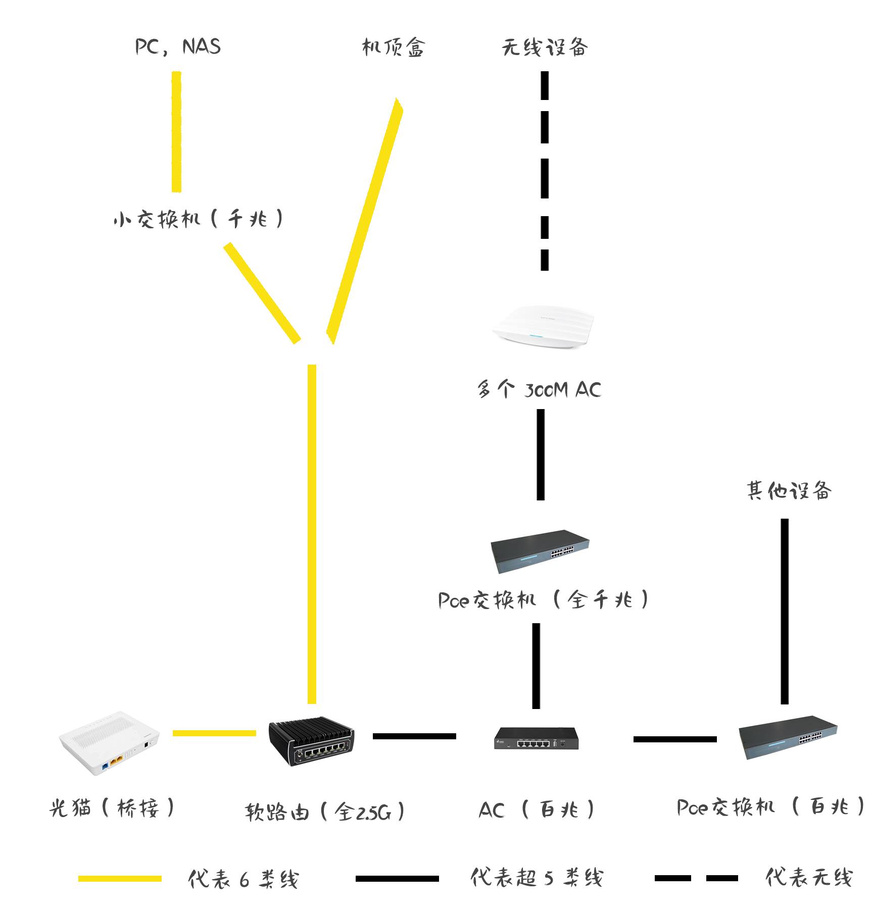
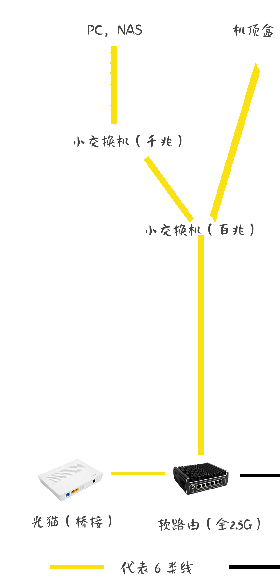
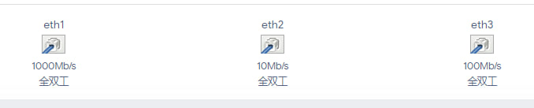
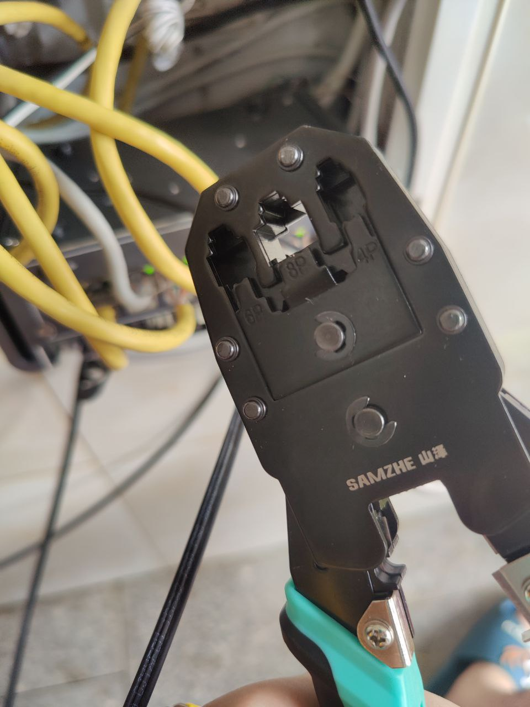
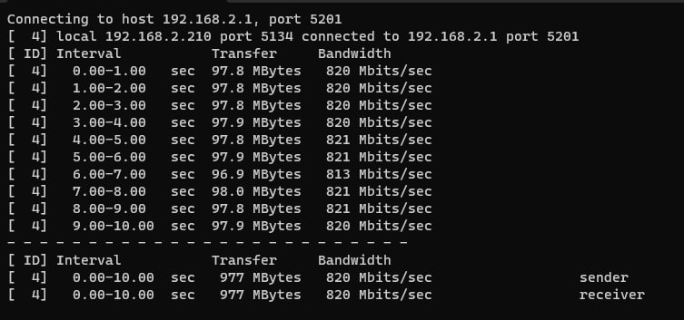
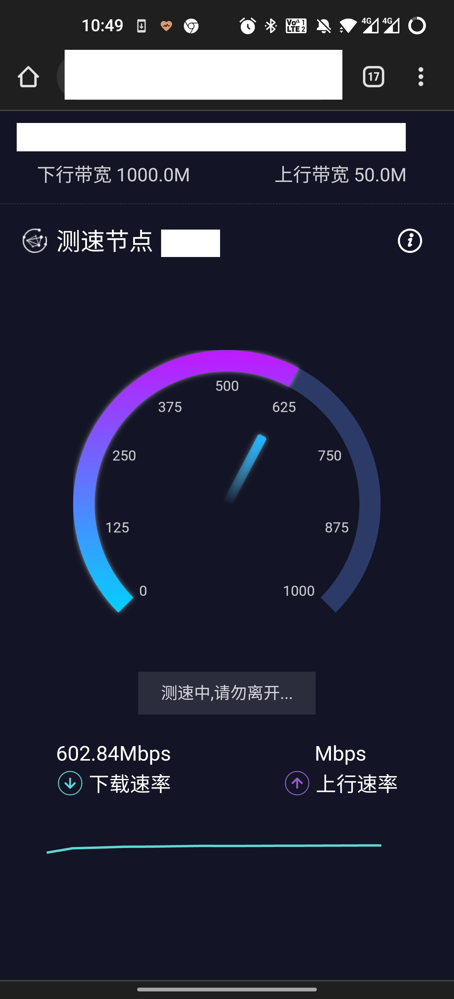

### 0 起因

我之前一直不满家里的百兆带宽，原因很简单: 百兆在普通家庭里打游戏，看视频或许够用，但对于在学校用惯 300m 带宽的我来说完全不够。

更何况，由于家里在我前一两年的折腾下已经装上软路由和 NAS 这两个可以吃高网速的设备，这让我对千兆网络更加的憧憬。我的 Steam 下载，BT 服务器等服务器带宽只能卡在 100 M 上上下下。

后来，我得知了我家里已经开通了千兆网，但据实际测速仍然是百兆。遂打电话投诉。然而等装网大哥到了测速才发现我家里是实实在在开通了千兆带宽，只是中间的设备不支持。

<!--more-->

看着网速测试仪直插路由器，测速网居然能在我的肉眼下跑到千兆！宛如神迹！于是我就迫不及待地开始折腾家里的千兆网络升级。

### 1 开始

首先需要折腾的是我家中的网络拓扑和设备型号。很遗憾，我家貌似并没有当时装修的弱电设计图，这意味着我必须自己一点点地去摸清楚大概每根网线的作用，工程量很大。幸好之前升级 IPv6 有做过一些，我大概用一天内摸鱼的时间收集到了以下信息：

首先是设备，在我家里有：一个运营商光猫（含一个千兆口），一个软路由（2.5g 网口），一个 tplink 路由器（百兆，在之前升级 ipv6 时已经被 ~~物理桥接~~ 停用），一个 tplink AC （百兆）， 一个 tplink 全千兆 poe 交换机（非网关），一个其他品牌的百兆 poe 交换机，一个小型桌面式 tenda 的千兆交换机。

其次是网络拓扑，我当时摸索出的网络拓扑是这样（实际上是对的网络拓扑）：

在图上很容易看的出来，只要将百兆的 AC 和 AP 换掉就能轻松全家千兆，当时我也是这么想的。

### 2 折磨开始

不知道你有没有仔细看我上面的拓扑图，如果你仔细看就会发现如果那个图是对的话，那我的电脑和 Nas 就已经是千兆了啊！但是我的 PC 和 Nas 测出工伤都只有百兆，这是怎么回事？

开始我认为是我资料查错了，认为这个千兆交换机是百兆交换机。但我确认检测了很多次，这个型号我没有查错。

接着我就开始想：“这个叫 tenda 的是什么野鸡牌子，它应该是标号千兆却只能跑百兆的东西，不是虚标就是在介绍和资料里玩了文字游戏”。但随着我查询的深入，它这个型号应该实实在在的确实是个千兆交换机。

但如果它是千兆的话，那问题出在哪儿了？不会是线吧，这可是六类线啊。

为了检测这个交换机是否有问题，我把路由到小交换机的线直插到了 PC 上，结果出乎我的意料：路由器直连都只有 100M！

然后我就麻了，我电脑不可能有问题。我软路由不可能有问题。线不太可能有问题，毕竟能跑百兆呢！那问题呢？

接着我就构想，可能在软路由到小交换机的连接上可能有一个百兆交换机卡在那里了，导致这样的情况。

但是我用了吃奶的劲也没有找那个应该存在的百兆路由器。在向装修团队确认了没有那种东西时，我只能不得不考虑是线或者水晶头的问题了。

首先，线的种类是没问题的，六类线不可能千兆不到。其次，第二天我让一个过来维修其他东西的帮忙用网线检测仪检测一下，发现灯是依次亮的，没有不亮的灯，这貌似也排除了水晶头的问题。

最后只能考虑可能是拉线的时候偷工减料，虽然我也觉得这个不太可能造假，但好像没有别的其他情况了。不过这个线是不太可能重拉的，成本太高了。难道我就只能忍受我的 PC 和 Nas 只能在千兆之下吗？我不能接受！

在更深入的测试中，我发现这条线的协商方式非常的诡异，它与我的主机协商比较慢，并且在拔插后可能开始会掉到 10M 的协商速度，过很久才会回到 100M。这个也不是 PC 设置的问题。在测试的过程中，曾经出现过网关界面显示 10M，100M，1000M 集邮画面。

在看过六类线水晶头接法后，我盯着这个水晶头陷入了沉思：

捏马，这不是错误的接法吗？两套接法标准连边都没沾上！

不过接法接错了居然还能正常上网，真的匪夷所思。

后面我下单了一个网线钳，六类头，在跟着视频尝试做线后，问题解决了。

虽然内网不知道为什么没到 1000 m，但是这个已经没问题了！

### 3 另一个折磨

虽然已经解决了那个问题，在还有一个问题跟上面的故事是平行的。这次千兆升级中还包含一个 AP 拓展，这个地方距离交换机，路由器有很长的一段距离，但之前装修时预留的线已经找到了，应该只是加个 AP 就行。

在上面确认交换机是千兆 poe 的之后，我下单了个 1300 tplink 的 AP，觉得只要装上去就好了，不会有任何其他问题。

但是，意想不到的事情发生了：我将 AP 连上网线后，AP 能正常收到电并且启动，但是却没有连接网络，没有收到 AC 的连接，网络设备也查无此人！

这意味着：这 AP 物理连接上了 poe 交换机，但是网络上并没有。这 tm 是什么鬼问题啊！

在单独测试设备，排除了许多因素，搜集了信息过后，我只能想到两种情况：

1. 网线过长，信号很弱。但是感觉这个说不过去，这个应该不是那么极端的一个环境。并且 poe 供电还有
2. 网线有问题。这个是一种无法确认的问题。

对于这两种情况，无论哪个都是我解决能力外的事情，只好请搞网络的师傅上门看看。

等到师傅上门，我把情况和它说了下，带他去看了拿一根线的情况，复现了下问题。

然后师傅看着水晶头对我说：“这个头，是你接的吗？“。

”不是“，我说。

他半信半疑的接受了我说的话，接着他说这个水晶头是有问题的。

于是他娴熟的把头卸掉再换了个上去，AP 成功启动了。然后我人就崩溃了，tmd, 接线的人都是没学过接头的吗？这还敢乱接？

于是这个问题成功的解决了。虽然不知道水晶头接线不对和 poe 供电有没有关系，但是已经无所谓了。

### 4 在这之后

在这之后的升级就是替换 AC 和 AP 了。AC 很简单，但换 AP 就麻烦了。由于 AP 是隐蔽接线的，我完全不知道在哪里。然后不出意外的，装修公司说这些东西也是没有资料记录的，只能根据装修人员的记忆慢慢找。。。

然后有线网是已经好了的，但是无论我怎么测怎么折腾，最高也就 600 m 出头，更多的是 300m，400m。距离那天看到的神迹还差得多，距离局域网测的 800+ m 也差得多。

无线也更不用说了，有线的损耗，路由的损耗，无线的损耗。到手机上只能测不到 100M。不过也还是比更新前要好的，之前是 40m 多。但短线直连的话无线也是可以跑到 600m 的。

总的来说，虽然结果也就差强人意，但在这折腾的路上还是学到了点东西，其中最重要的一课就是不要太相信外面的人的专业水平，连水晶头都能接错也是够离谱的。