## 前言
UNITY 的解包封包的汉化不太适合啥都不明白的小白，需要一点的技术阅历和编写基础文件操作代码的能力。
如果你只是想自己玩的爽的话可以转身去其他插件汉化以及 Hook 汉化的文章

## 0. 工具准备
[AssetStudioModGUI](https://github.com/aelurum/AssetStudio): 能够预览和解包 unity 资源，原版没更新记得用 fork 版
[UABEA](https://github.com/nesrak1/UABEA): 批量解压，批量打包，打包的核心工具
010editor: 查看 dump 文件的二进制结构，解析文件类型
如果你不喜欢 010 editor，也可以用 HXD 开源小工具来平替

## 1.寻找字符串位置
可以参考这篇文章的流程，寻找字符串可能会在的位置 https://www.bilibili.com/opus/830797634583134281
一般情况是存在于 unity asset 中的 TextAsset 类型和 monobehaviour 中，部分 UI 或者小段文字可能存在于游戏的核心 dll 中（如果是 il2cpp 就是 PC 的 GameAssembly.dll 或者 安卓的 libil2cpp.so）里面，这部分修改较为麻烦
一般来说，我们一般在 asset 里面就能找到大段文本，这里就需要用我们上面的工具 AssetStudioModGUI 来查找
在游戏的根目录，有一堆 asset 的目录下，用该工具加载文件夹
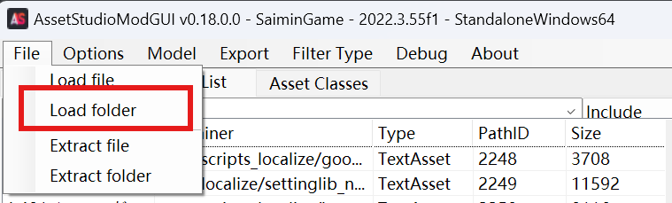

加载完后，就能看到大部分游戏中使用的资源文件，筛选出 TextAsset 的类型查看是否是游戏中对应的文本。
最好的情况就是预览就能看出明文，那么在后续直接在 UABEA dump 对应文本再打包就可以实现

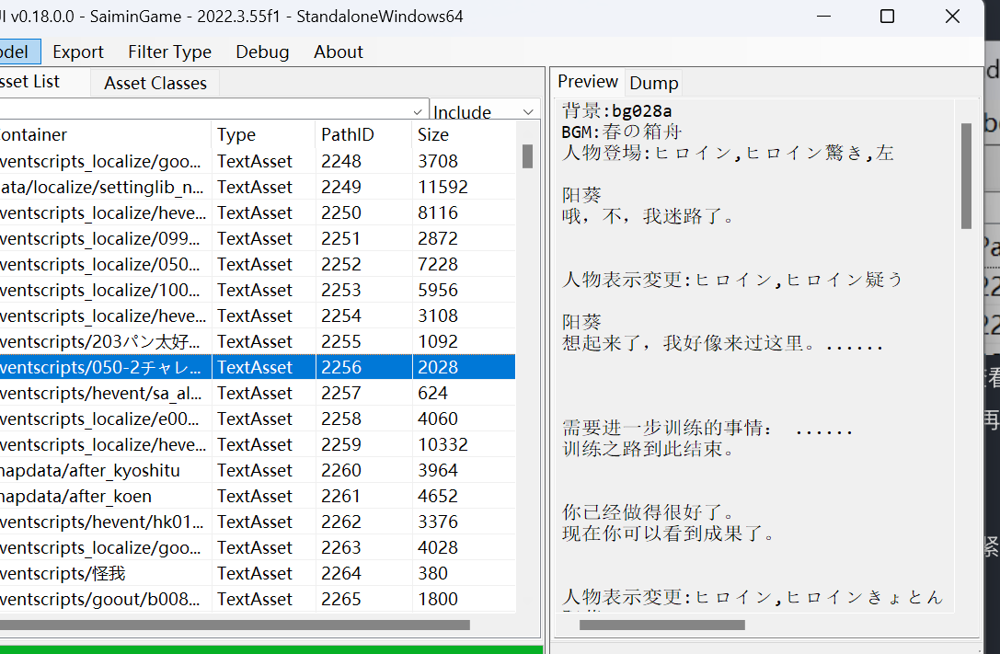

但是文本到底是怎么读取的，需要自己去判断，图示的虽然有我们游戏中的文本，但也有作者写好的对应的脚本指令，这部分就不能汉化
比较差的情况就是可能会出现一堆乱码，预览根本看不出来

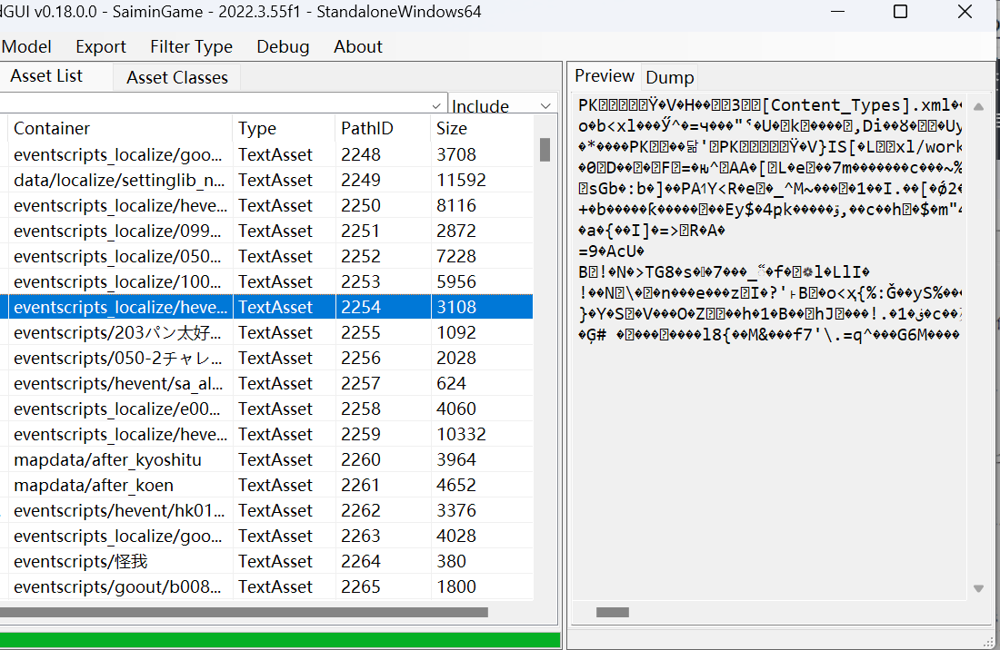

这个时候就需要 dump 下来，使用 UABEA 或者 AssetStudio DUMP 都可以，dump 下来自己仔细分析

### 如何使用 UABEA dump:
在 AssetStudio 里选择对应资源，再确认对应的 Asset 文件

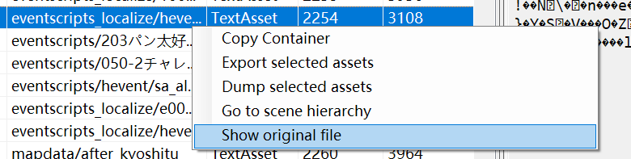
确认完后用 UABEA 打开，再根据 pathid 排序找到对应的资源，在右侧使用 Plugins 里面的 dump 功能

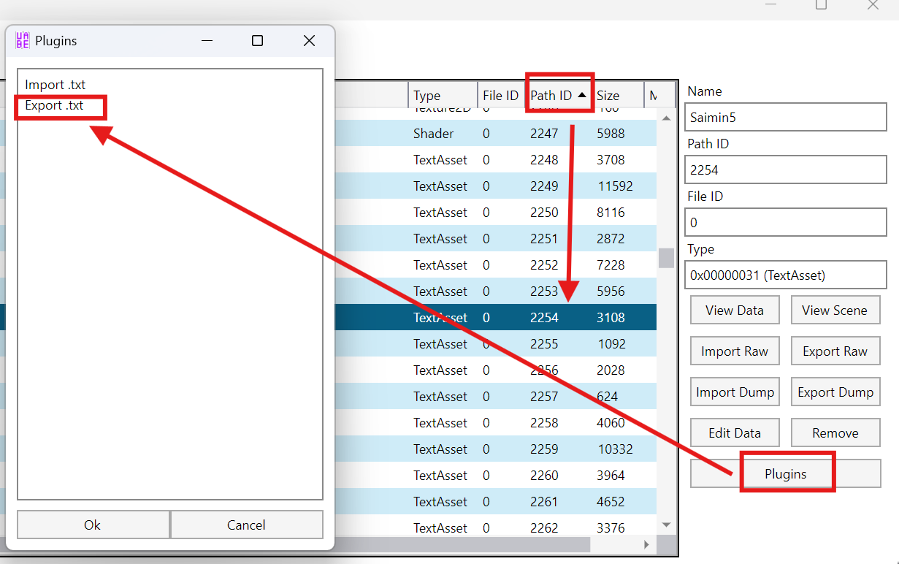

我这边只推荐该功能的 dump，其他工具的 dump 可能格式不相同导致无法查看对应的二进制格式

### 判断文件类型
先是查看这个是不是编码问题，即换不同的编码去尝试打开该文本。这边使用 vscode 来切换编码
在右下角切换编码类型，再输入你想用的编码（一般是图示的两个）

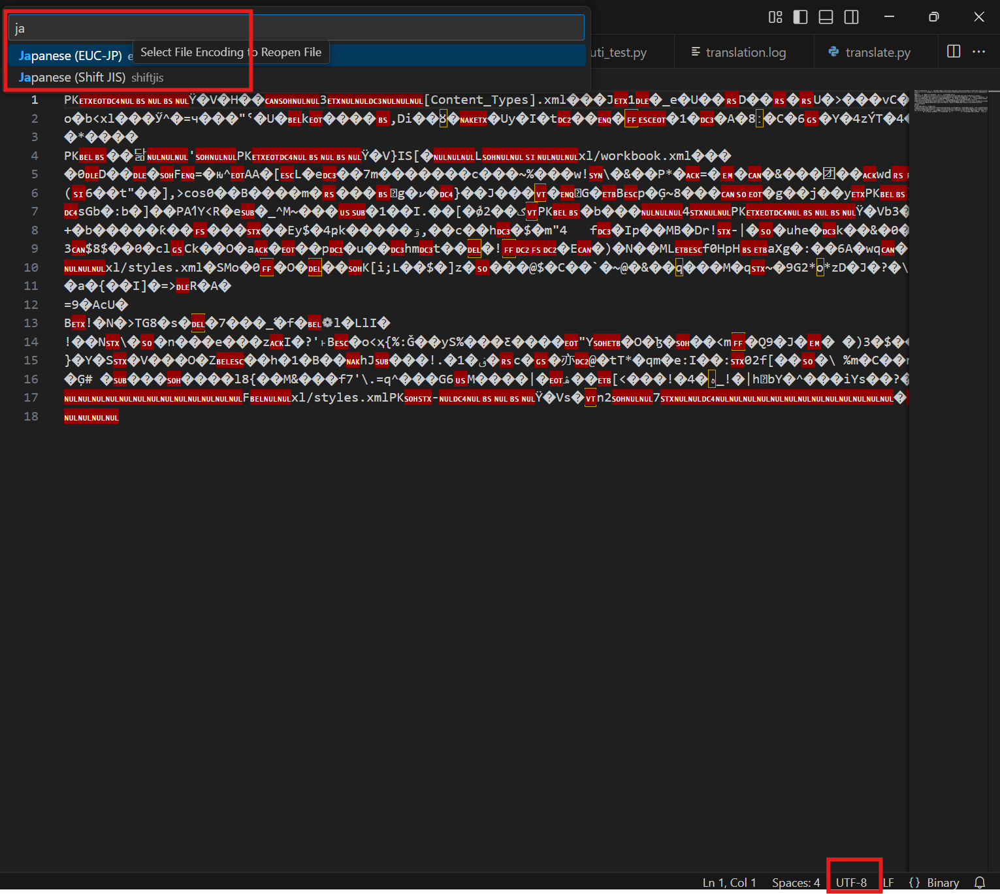
如果还是大段的乱码，那么就要使用 010 editor 或者 hxd 来分析
复制开头的几个字节（正式名字叫 magic number)，丢入 google 搜索，也可以问 GPT

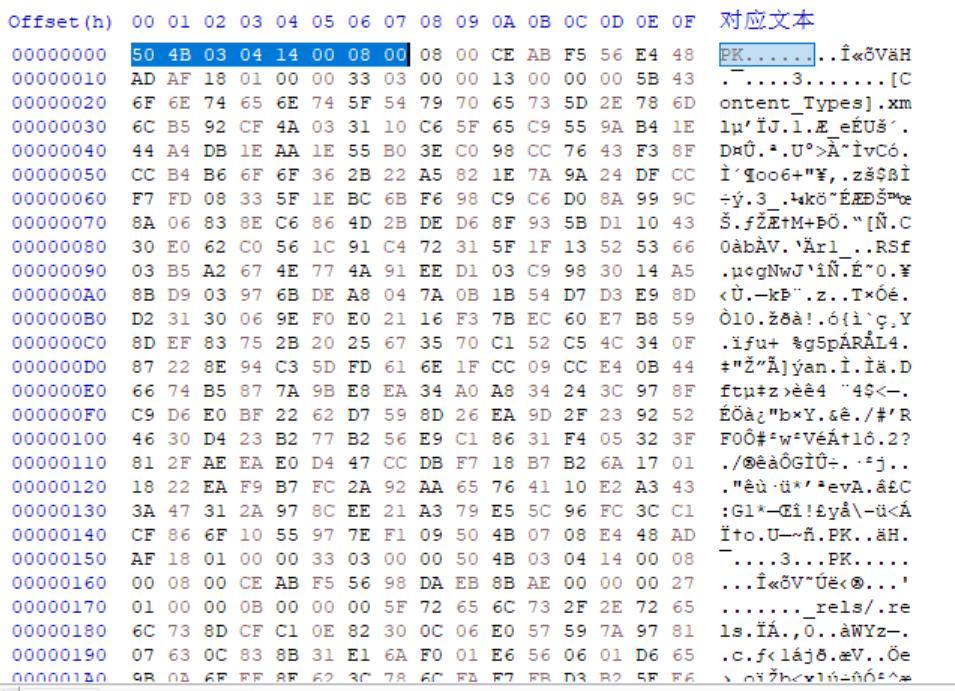
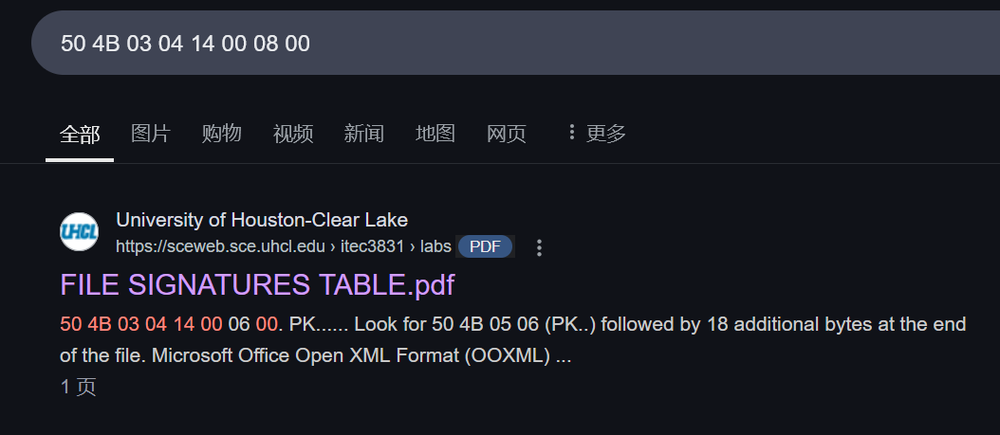

很简单，知道了这个是 xlsx  ecexll 文件的文件头，那么我们把这个文件的后缀 改成 xlsx 就能正常打开了

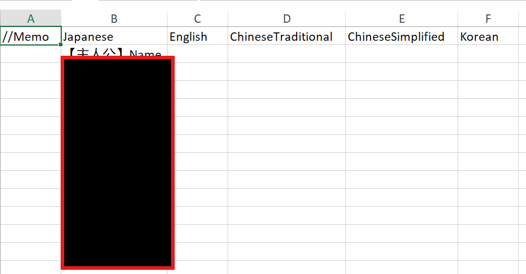

那么不难猜出这个游戏就是围绕着 excel 存取文本的，那么后面的翻译也是围绕着 dump 出来的 excel 翻译再打包回去
如果 google 或者 GPT 查无此文件头，那么你可以试试比较正规的软件如 binwalk 或者 linux 系统的 file 命令去确定该文件类型
也会存在一个游戏使用不同的方式存取文本，接着使用上面的判断即可
**如果上述的方法都无法确认，那么这个就不是你一个作为稍微懂点技术的人该接触的作品，而是逆向工程的领域。这一部分在后面会介绍**

## 汉化文字
确定好文字读取格式之后的话，剩下的就很简单了。选择一门你会的语言，编写一些基本的文件操作来提取文件中的文字并使用翻译软件翻译。这一部分不会设计具体代码实现，因为实际情况都有所差别。我接着使用上文例子作为参考
使用 UABEA 批量提取对应资源，直接 shitf 选中再使用上面的方式 dump

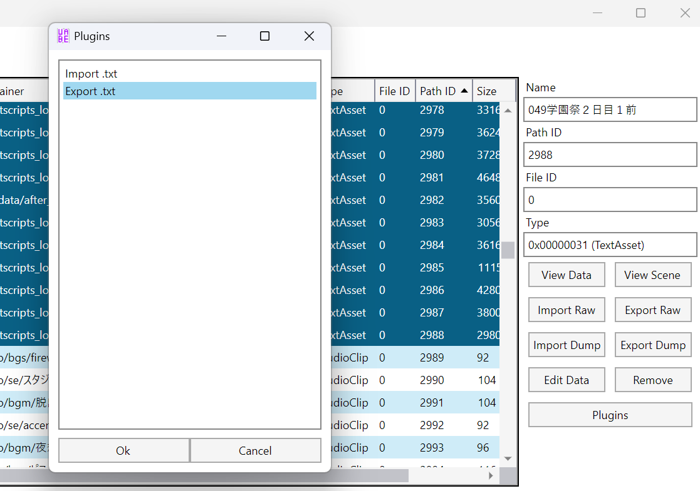

通过上面的方式你应该大概明白各个文件的格式了，写代码提取文本内容，翻译，再写回原文件
比如 excel 就是使用相关的 api 读取，以文件形式写入，后面再改回原 dump 的 txt 格式
如果不同的格式的话，就要写代码将其分离开分开翻译再合并这样
确认翻译好的文件一件不落，和原 dump 文件数量一致后，就可以接着批量选回文件再在 plugins 里的 import 里面选择你存好的文件夹，再全部选上。记得一定要数量和之前 dump 和选中数量一致。一定要 txt 格式
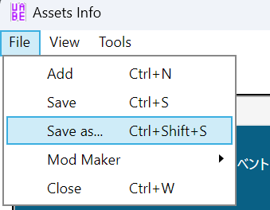

存好后再保存 asset 覆盖原 asset 就可以了
如果上面的都没问题的话，恭喜你，至少关于 asset 中的 TextAsset  文本汉化都难不倒你了。游戏里的大部分文本你显示应该都没问题了

## 关于安卓打包
debugkey 位置 `%USERPROFILE%\.android\debug.keystore`
先 `apktool d xxx.apk`
然后`apktool b xxx`
`./apksigner.bat sign --ks %USERPROFILE%\.android\debug.keystore --ks-pass pass:android --ks-key-alias androiddebugkey --key-pass pass:android xxx.apk`
## 更深一步
如果你想更彻底的汉化，把部分 asset 找不到的文字汉化，或者你找不到解析文件的方法，或者你只是想了解一下底层是怎么样的，我这边只能给一点方法上的引导
需要说明的一点，这内容只对 il2cpp 的 unity 游戏有用，而且大部分内容可能https://www.bilibili.com/opus/830797634583134281 已经提到过了，重复的部分不赘述
关于教程中的很多 “**Assembly-CSharp.dll**” 在 il2cpp 中是被整合在了PC 的 GameAssembly.dll 或者 安卓的 libil2cpp.so，所以我们的分析会更麻烦一些
参考逆向大佬的文章：https://bbs.kanxue.com/thread-278275.htm
根据文章的方法提取 dll，解析出其他 dll 和符号，最重要的是符号资源，再在 ida 中打开原 GameAssembly.dll，根据文章的方法恢复符号
后面的逆向方法就要看个人的逆向能力了，比较基础的就是根据符号信息判断用户代码，定位到比较关键的读取，UI，对话相关的位置。以上面的游戏来举个例子
先是动态调试，对于 PC 就使用 local gdb，再正常输入内容调试

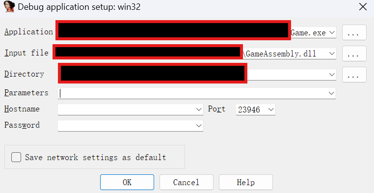

下断点断到核心位置，判断它是如何操作的

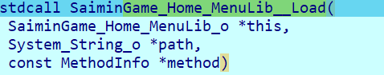
我们再这个 menu load 函数下断点，这个非常可疑，根据符号能判断出来传入的是路径，不难猜出这个是读取文件提取 UI 文字的功能，具体内容还得调试分析

根据传参，内容分析，还有符号信息，可以知道它是读取了 “Data/Menu”的文件，使用 excel 相关的库提取文字
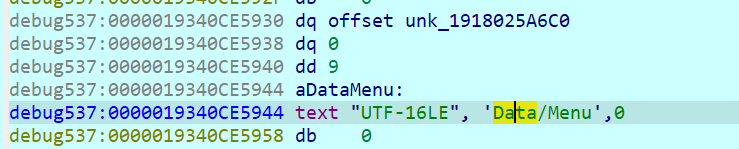
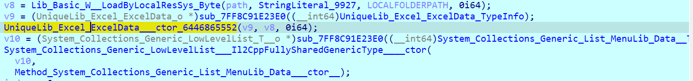
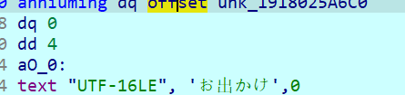

再在 AssetStudio 的目录下下找到该文件，dump 发现确实符合逻辑
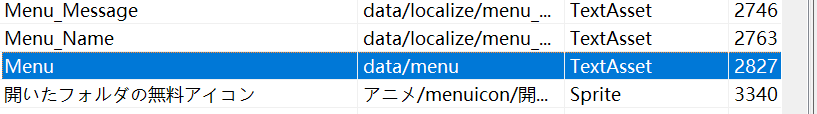