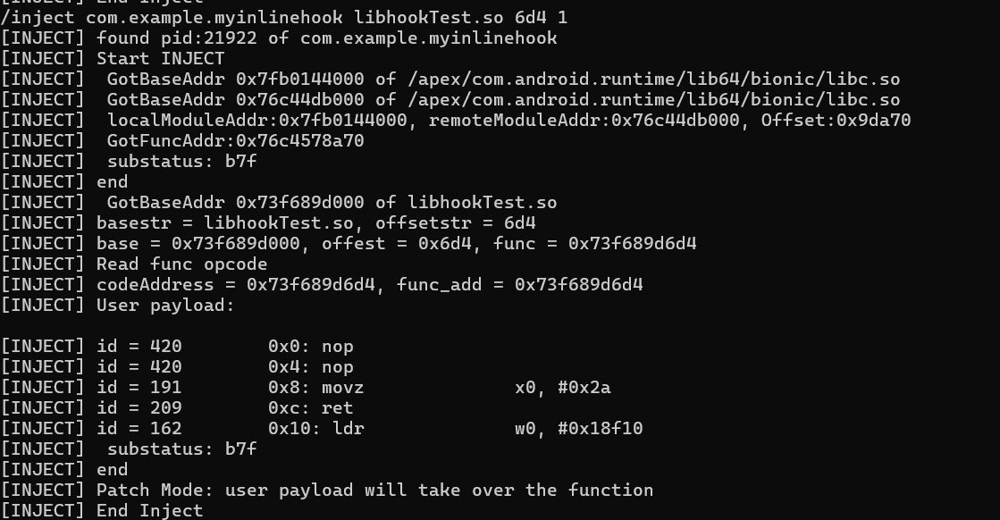

## android inline hook demo 实现

如何实现一个安卓的 inline hook demo？实际上不太难，核心思想就是用 ptrace 进入进程，然后再在内存空间分配 payload，再把函数点替换成跳板函数跳到我们的 payload 里，同时实现上下文保存。执行完后再执行源代码返回
虽然基础逻辑不太难，但是一些细节实现还是有点麻烦。最开始要想 ptrace 成功 attach，需要一系列的自动化获取 pid，修改内存，还有获取关键的系统函数 mmap 啥的。这部分参考前人的代码，还算是有简单的脚手架可以用。也参考过 frida 的实现，但是其实现的耦合程度有点高，要想提取出来太麻烦了
在注入后，就要考虑 payload 的构造。这部分不太难，但要自动化也有点麻烦。主要考虑到 demo 性质的程序就不需要太完美的框架，我这边就实现了保存上下文，提供 buffer，指令修复，用户代码就简单用汇编修改逻辑就行。不过像其他比较成熟的方案，就在保持上下文后，用系统库加载用户 so 库在执行用户代码，或者干脆就是 frida 的一套完整的 java 执行器逻辑
除开上面两点，还有一个非常重要的就是跳板函数的实现了。由于 arm 64 之后不能简单操作 pc 寄存器，现在的跳板指令从之前的 8 byte 两个指令陡增为 16 bytes (frida),，而我这边是 24 bytes 的长度。事实上通用无损最短应该怎么也要 20 bytes 多 ，但 frida 这边短了但也是有代价的，不过我们后面再说。由于这个比较长的跳板替换，使得原来比较方便的修复也变得有点麻烦。因为一旦替换到了如跳转之类的命令，那么这个处理起来就不是单纯的再执行一遍那么简单，并且 arm 的远程跳转处理起来确实麻烦。事实上 frida 也是做了很多工作来处理这些命令，下面我们会参考 frida 是怎么实现的

## Frida 源码分析 (gum)
事实上，主要涉及到跳板函数的代码就在 [**gumarm64relocator.c**](https://github.com/frida/frida-gum/blob/main/gum/arch-arm64/gumarm64relocator.c) 这个文件里面，以下就是对  gumarm64relocator.c 的分析
函数
```c
static gboolean gum_arm64_relocator_rewrite_ldr (GumArm64Relocator * self,
                                                 GumCodeGenCtx * ctx);
static gboolean gum_arm64_relocator_rewrite_adr (GumArm64Relocator * self,
                                                 GumCodeGenCtx * ctx);
static gboolean gum_arm64_relocator_rewrite_b (GumArm64Relocator * self,
                                               GumCodeGenCtx * ctx);
static gboolean gum_arm64_relocator_rewrite_b_cond (GumArm64Relocator * self,
                                                    GumCodeGenCtx * ctx);
static gboolean gum_arm64_relocator_rewrite_bl (GumArm64Relocator * self,
                                                GumCodeGenCtx * ctx);
static gboolean gum_arm64_relocator_rewrite_cbz (GumArm64Relocator * self,
                                                 GumCodeGenCtx * ctx);
static gboolean gum_arm64_relocator_rewrite_tbz (GumArm64Relocator * self,
                                                 GumCodeGenCtx * ctx);

```
### 指令扫描
#### **流程**
先确认跳板长度，能否达到最低，并且判断是否有 ret or BR
如果跳板内没结束，则步进代码，一遍遍跑并且记录跳转地址
如果跳转到跳板内，则跳板最长为跳转 offset
判断 x16 x17 寄存器有没有使用过
如果可用跳板长度没达到最短，则 return false
#### **跳板内筛查**
```c
switch (insn->id)
{
  case ARM64_INS_B: // B 代表块结束，但是不一定 func 结束
    self->eob = TRUE; // end of block
    self->eoi = gum_arm64_branch_is_unconditional (insn); // end of Interrupt
    break;
  case ARM64_INS_BR:
  case ARM64_INS_BRAA:
  case ARM64_INS_BRAAZ:
  case ARM64_INS_BRAB:
  case ARM64_INS_BRABZ:
  case ARM64_INS_RET:
  case ARM64_INS_RETAA:
  case ARM64_INS_RETAB: // BR，RET 代表块和逻辑结束
    self->eob = TRUE;
    self->eoi = TRUE;
    break;
  case ARM64_INS_BL:
  case ARM64_INS_BLR:
  case ARM64_INS_BLRAA:
  case ARM64_INS_BLRAAZ:
  case ARM64_INS_BLRAB:
  case ARM64_INS_BLRABZ: // BL 会返回代表块结束，逻辑没结束
    self->eob = TRUE;
    self->eoi = FALSE;
    break;
  case ARM64_INS_CBZ:
  case ARM64_INS_CBNZ:
  case ARM64_INS_TBZ:
  case ARM64_INS_TBNZ: // 条件跳转会返回代表块结束，逻辑没结束
    self->eob = TRUE;
    self->eoi = FALSE;
    break;
  default:
    self->eob = FALSE;
    break;
}

```
为啥 BR 会标记为逻辑结束呢？可能是因为对于它后面的代码的访问不可控，就算有后面流程的遍历也可能会存在目前到达不了后面的情况，所以和 ret 一个待遇
#### **遍历代码记录跳转地址**
```c
if (!rl.eoi) // 如果在 跳板 内没有结束
{
  GHashTable * checked_targets, * targets_to_check;
  csh capstone;
  cs_insn * insn;
  const guint8 * current_code;
  uint64_t current_address;
  size_t current_code_size;
  gpointer target;
  GHashTableIter iter;

  checked_targets = g_hash_table_new (NULL, NULL);
  targets_to_check = g_hash_table_new (NULL, NULL);

  cs_open (CS_ARCH_ARM64, GUM_DEFAULT_CS_ENDIAN, &capstone);
  cs_option (capstone, CS_OPT_DETAIL, CS_OPT_ON);

  insn = cs_malloc (capstone);
  current_code = rl.input_cur;
  current_address = rl.input_pc;
  current_code_size = 1024;

  do
  {
    gboolean carry_on = TRUE;

    g_hash_table_add (checked_targets, (gpointer) current_code);

    gum_ensure_code_readable (current_code, current_code_size);

    while (carry_on && cs_disasm_iter (capstone, &current_code,
                                       &current_code_size, &current_address, insn))
    {
      cs_arm64 * d = &insn->detail->arm64;

      switch (insn->id)
      {
        case ARM64_INS_B: // 如果有相对跳转，用 hash 表存下后面看看
          {
            cs_arm64_op * op = &d->operands[0];

            g_assert (op->type == ARM64_OP_IMM);
            target = GSIZE_TO_POINTER (op->imm);
            if (!g_hash_table_contains (checked_targets, target)) // 判断是否已经遍历过
              g_hash_table_add (targets_to_check, target);

            carry_on = d->cc != ARM64_CC_INVALID && d->cc != ARM64_CC_AL &&
              d->cc != ARM64_CC_NV;

            break;
          }
        case ARM64_INS_CBZ:
        case ARM64_INS_CBNZ: // 如果有条件跳转，用 hash 表存下后面看看
          {
            cs_arm64_op * op = &d->operands[1];

            g_assert (op->type == ARM64_OP_IMM);
            target = GSIZE_TO_POINTER (op->imm);
            if (!g_hash_table_contains (checked_targets, target))
              g_hash_table_add (targets_to_check, target);

            break;
          }
        case ARM64_INS_TBZ:
        case ARM64_INS_TBNZ: // 如果有条件跳转，用 hash 表存下后面看看
          {
            cs_arm64_op * op = &d->operands[2];

            g_assert (op->type == ARM64_OP_IMM);
            target = GSIZE_TO_POINTER (op->imm);
            if (!g_hash_table_contains (checked_targets, target))
              g_hash_table_add (targets_to_check, target);

            break;
          }
        case ARM64_INS_RET:
        case ARM64_INS_RETAA:
        case ARM64_INS_RETAB: // 如果离开，不用 copy 了
          {
            carry_on = FALSE;
            break;
          }
        case ARM64_INS_BR:
        case ARM64_INS_BRAA:
        case ARM64_INS_BRAAZ:
        case ARM64_INS_BRAB:
        case ARM64_INS_BRABZ: // 如果寄存器无 lr 跳转（等同于离开），不用 copy 了
          {
            carry_on = FALSE;
            break;
          }
        default:
          break;
      }
    }

    g_hash_table_iter_init (&iter, targets_to_check);
    if (g_hash_table_iter_next (&iter, &target, NULL)) // 如果 target 对应的没有遍历过，就接着步进
    {
      current_code = target;
      if (current_code > rl.input_cur)
        current_address = (current_code - rl.input_cur) + rl.input_pc;
      else
        current_address = rl.input_pc - (rl.input_cur - current_code);
      g_hash_table_iter_remove (&iter);
    }
    else 
    {
      current_code = NULL;
    }
  }
  while (current_code != NULL);

  g_hash_table_iter_init (&iter, checked_targets);
  while (g_hash_table_iter_next (&iter, &target, NULL)) // 如果 target 对应的没有遍历过
  {
    gssize offset = (gssize) target - (gssize) address;
    if (offset > 0 && offset < (gssize) n) // 如果有地址位于 跳板
    {
      n = offset; //那么最大长度就为 offset
      if (n == 4) // 4 bytes 直接寄
        break;
    }
  }

  cs_free (insn, 1);

  cs_close (&capstone);

  g_hash_table_unref (targets_to_check);
  g_hash_table_unref (checked_targets);
}

```
对于扫描的X16 和 X17，会用作后面跳转
```c
if (available_scratch_reg != NULL)
{
  gboolean x16_used, x17_used;
  guint insn_index;

  x16_used = FALSE;
  x17_used = FALSE;

  for (insn_index = 0; insn_index != n / 4; insn_index++)
  {
    const cs_insn * insn = rl.input_insns[insn_index];
    const cs_arm64 * info = &insn->detail->arm64;
    uint8_t op_index;

    for (op_index = 0; op_index != info->op_count; op_index++)
    {
      const cs_arm64_op * op = &info->operands[op_index];

      if (op->type == ARM64_OP_REG)
      {
        x16_used |= op->reg == ARM64_REG_X16;
        x17_used |= op->reg == ARM64_REG_X17;
      }
    }
  }

  if (!x16_used)
    *available_scratch_reg = ARM64_REG_X16;
  else if (!x17_used)
    *available_scratch_reg = ARM64_REG_X17;
  else
    *available_scratch_reg = ARM64_REG_INVALID;
}

```
没有 X16 或者 X17 就会报错
```c
if (data->scratch_reg == ARM64_REG_INVALID)
  goto no_scratch_reg;

return TRUE;

no_scratch_reg:
{
  gum_code_slice_unref (ctx->trampoline_slice);
  ctx->trampoline_slice = NULL;
  return FALSE;
}

```
直接再 backend_create 阶段返回 FALSE
```c
if (!gum_interceptor_backend_prepare_trampoline (self, ctx, &need_deflector))
  return FALSE;

```
### 指令修复
这边 frida 列出了几个需要特别处理的汇编指令，基本都是和跳转相关的
```c
switch (insn->id)
{
  case ARM64_INS_LDR:
  case ARM64_INS_LDRSW:
    rewritten = gum_arm64_relocator_rewrite_ldr (self, &ctx);
    break;
  case ARM64_INS_ADR:
  case ARM64_INS_ADRP:
    rewritten = gum_arm64_relocator_rewrite_adr (self, &ctx);
    break;
  case ARM64_INS_B:
    if (gum_arm64_branch_is_unconditional (ctx.insn))
      rewritten = gum_arm64_relocator_rewrite_b (self, &ctx);
    else
      rewritten = gum_arm64_relocator_rewrite_b_cond (self, &ctx);
    break;
  case ARM64_INS_BL:
    rewritten = gum_arm64_relocator_rewrite_bl (self, &ctx);
    break;
  case ARM64_INS_CBZ:
  case ARM64_INS_CBNZ:
    rewritten = gum_arm64_relocator_rewrite_cbz (self, &ctx);
    break;
  case ARM64_INS_TBZ:
  case ARM64_INS_TBNZ:
    rewritten = gum_arm64_relocator_rewrite_tbz (self, &ctx);
    break;
  default:
    rewritten = FALSE;
    break;
}

```
这些指令为：

- ldr, adr, 会涉及相对读取
- b bl 会涉及相对跳转
- cbz cbnz tbz tbnz 会涉及条件跳转
- 对于 LDR or LDRSW
  - 判断浮点数
    判断是否是非 X29 or X30 reg
    然后计算

```c
if (dst->reg >= ARM64_REG_W0 && dst->reg <= ARM64_REG_W28) // 如果是 32 位寄存器
  tmp_reg = ARM64_REG_X0 + (dst->reg - ARM64_REG_W0); // 用 64 寄存器转化
else if (dst->reg >= ARM64_REG_W29 && dst->reg <= ARM64_REG_W30) // 如果是 pc or LR
  tmp_reg = ARM64_REG_X29 + (dst->reg - ARM64_REG_W29); // 用 64 寄存器转化
else
  tmp_reg = dst->reg; // 64 位不用转化

gum_arm64_writer_put_ldr_reg_address (ctx->output, tmp_reg, src->imm); // 将绝对地址算好，存进 tmp reg
if (insn_id == ARM64_INS_LDR) // 如果是 LDR
{
  gum_arm64_writer_put_ldr_reg_reg_offset (ctx->output, dst->reg, tmp_reg,  
                                           0); // 然后寄存器传参
}
else
{
  gum_arm64_writer_put_ldrsw_reg_reg_offset (ctx->output, dst->reg, tmp_reg,
                                             0);// 一样
}

```
核心思想是提前算好地址，再用两条指令替换原来的一条
ps: 实际`gum_arm64_writer_put_ldr_reg_address`的实现是打个 pc 标记和 num，待到生成的时候直接计算好用 ldr 替换

```c
gum_arm64_writer_add_literal_reference_here (self, val, GUM_LITERAL_64BIT);
gum_arm64_writer_put_ldr_reg_pcrel (self, &ri, 0);

```
对于 ARM64_INS_ADR 和 ADRP
读相对地址内容到寄存器
一样插桩替换就行

```c
gum_arm64_writer_put_ldr_reg_address (ctx->output, dst->reg, label->imm);
```
对于 B
要区别是否有条件跳转
无条件

```c
gum_arm64_writer_put_ldr_reg_address (ctx->output, ARM64_REG_X16,
                                      gum_arm64_writer_sign (ctx->output, target->imm)); // ldr 绝对地址到 x16
gum_arm64_writer_put_br_reg (ctx->output, ARM64_REG_X16); // br 寄存器跳转

```
有条件
```c
gum_arm64_writer_put_b_cond_label (ctx->output, ctx->detail->cc, is_true);
gum_arm64_writer_put_b_label (ctx->output, is_false); // 还原判断

gum_arm64_writer_put_label (ctx->output, is_true); // 如果为 ture 跳转
gum_arm64_writer_put_ldr_reg_address (ctx->output, ARM64_REG_X16,
                                      gum_arm64_writer_sign (ctx->output, target->imm)); // 正常 br 寄存器跳转
gum_arm64_writer_put_br_reg (ctx->output, ARM64_REG_X16);

gum_arm64_writer_put_label (ctx->output, is_false); // 如果为 flase, 跳到这里，继续走

```
对于 BL
因为仅对于 LR 来说，到这里后 LR 若不是提前被存起来了，就是用不到了（遵循源代码逻辑）
所以我们可以不用 X16 改用 LR 来存绝对跳转地址
```c
gum_arm64_writer_put_ldr_reg_address (ctx->output, ARM64_REG_LR,
                                      gum_arm64_writer_sign (ctx->output, target->imm)); // 因为 lr 寄存器不用了，所以拿来存跳转地址
gum_arm64_writer_put_blr_reg (ctx->output, ARM64_REG_LR);// ldr , r 为上面的 lr

```
对于 CBZ，CBNZ
CBZ: 如果 reg 为 0， 就跳转相对地址
CBNZ：如果 reg 不为 0， 就跳转相对地址
一样复现
```c
if (ctx->insn->id == ARM64_INS_CBZ)
  gum_arm64_writer_put_cbz_reg_label (ctx->output, source->reg, is_true); // cp cbz，若符合条件到 true
else
  gum_arm64_writer_put_cbnz_reg_label (ctx->output, source->reg, is_true); // cp cbz，若符合条件到 true
gum_arm64_writer_put_b_label (ctx->output, is_false); // pass 到后面继续走

gum_arm64_writer_put_label (ctx->output, is_true); // ture, 寄存器跳转
gum_arm64_writer_put_ldr_reg_address (ctx->output, ARM64_REG_X16,
                                      gum_arm64_writer_sign (ctx->output, target->imm));
gum_arm64_writer_put_br_reg (ctx->output, ARM64_REG_X16);

gum_arm64_writer_put_label (ctx->output, is_false); // 后面

```
对于 TBZ, TBNZ
TBZ: 查询 reg 某位是否为 0，如果是就跳转
TBZ: 查询 reg 某位是否不为 0，如果是就跳转
和上面一样，不写了
一些细节：由于我们只考虑单线程操作，就不考虑多线程的情况，也就不用 hash map 来存地址啥的
## 代码实现
代码部分主要参考了 https://github.com/zhuotong/Android_InlineHook ，非常好文章和代码，于是我的 ptrace 相关代码大部分参考的是这个项目的，不用造轮子了。但已经 gradlew 已经寄了，导致 ndk 编译不起来很麻烦。而且这个代码也有点老了导致编译很多都不可用，而且没有 capstone 导致没办法做指令修复，所以魔改增加了很多代码。把编译环境设置成标准的的 ndk 环境，精简了很多
代码注入的部分就不说了，基本没变，参考上面文章。要说的话就为了方便多了个找基地址的功能
我们主要来说说 shellcode 和指令修复

### shellcode
```asm
.global replace_start
.global userfunc
.global replace_end
.global retfunc
.global after_call
.global numdata

.hidden replace_start
.hidden userfunc
.hidden replace_end
.hidden retfunc
.hidden after_call
.hidden numdata

.data

//这种方式尽量用于标准的c/c++函数，因为通过hook函数再调用原函数，只能保证参数寄存器和lr寄存器是一致的，其他寄存器可能被修改。

replace_start:                      //如果只是替换/跳到hook函数，其实是不用保存寄存器的，只是重新写比较麻烦，所以在之前的基础上

    sub     sp, sp, #0x20;      //跳板在栈上存储了x0、x1，但是未改变sp的值

    mrs     x0, NZCV;            //将 NZCV 存在 x0 中
    str     x0, [sp, #0x10];    //覆盖跳板存储的x1，存储状态寄存器
    str     x30, [sp];          //存储x30
    add     x30, sp, #0x20
    str     x30, [sp, #0x8];    //存储真实的sp
    ldr     x0, [sp, #0x18];    //取出跳板存储的x0

    sub     sp, sp, #0xf0;      //分配栈空间
    stp     X0, X1, [SP];       //存储x0-x29
    stp     X2, X3, [SP,#0x10]  //10
    stp     X4, X5, [SP,#0x20]
    stp     X6, X7, [SP,#0x30]
    stp     X8, X9, [SP,#0x40]
    stp     X10, X11, [SP,#0x50]
    stp     X12, X13, [SP,#0x60]
    stp     X14, X15, [SP,#0x70]
    stp     X16, X17, [SP,#0x80]
    stp     X18, X19, [SP,#0x90]
    stp     X20, X21, [SP,#0xa0]
    stp     X22, X23, [SP,#0xb0]    //20
    stp     X24, X25, [SP,#0xc0]
    stp     X26, X27, [SP,#0xd0]
    stp     X28, X29, [SP,#0xe0]

    nop;                            //hook 主体
    ldr     x3, userfunc            //调用用户 payload
    blr     x3
    nop
    ldr     x0, [sp, #0x100];       //取出状态寄存器
    msr     NZCV, x0

    ldp     X0, X1, [SP];           //恢复x0-x29寄存器
    ldp     X2, X3, [SP,#0x10]
    ldp     X4, X5, [SP,#0x20]
    ldp     X6, X7, [SP,#0x30]
    ldp     X8, X9, [SP,#0x40]
    ldp     X10, X11, [SP,#0x50]
    ldp     X12, X13, [SP,#0x60]
    ldp     X14, X15, [SP,#0x70]    //40
    ldp     X16, X17, [SP,#0x80]
    ldp     X18, X19, [SP,#0x90]
    ldp     X20, X21, [SP,#0xa0]
    ldp     X22, X23, [SP,#0xb0]
    ldp     X24, X25, [SP,#0xc0]
    ldp     X26, X27, [SP,#0xd0]
    ldp     X28, X29, [SP,#0xe0]
    add     sp, sp, #0xf0

    ldr     x30, [sp];              //恢复x30
    add     sp, sp, #0x20;          //恢复为真实sp,50

    nop;                            //br lr                          
    nop;                            //nop

    b       qwq;           //跳过 data
userfunc:                           //userfunc
.quad 0xffffffffffffffff
retfunc:                            //userfunc
.quad 0xffffffffffffffff

qwq:
    LDUR    X0, [SP,#-8];           //恢复x0
after_call:                         //存 24 byte code
    nop
    nop
    nop
    nop
    nop
    nop
    nop
    nop
    nop
    nop
    nop
    nop
    nop
    nop
    nop
    nop
    nop
    nop
    nop
    nop
    nop
    nop
    nop
    nop
    nop
    nop
    nop
    nop
    nop
    nop
    nop
    nop
    nop
    nop
    nop
    nop
    nop
    nop
    nop
    nop
    nop
    nop
    nop
    nop
    B jump_end;
    nop
    nop
    nop
    nop
    nop
numdata:
    nop
    nop
    nop
    nop
    nop
    nop
    nop
    nop
    nop
    nop
    nop
    nop
    nop
    nop
    nop
    nop
    nop
    nop
    nop
    nop
    nop
    nop
    nop
    nop
    nop
    nop
    nop
    nop
    nop
    nop
    nop
    nop
    nop
    nop
    nop
    nop
    nop
    nop
    nop
    nop
    nop
    nop
    nop
    nop
    nop
    nop
    nop
    nop
    nop
    nop
jump_end:
    STP     X1, X0, [SP,#-0x10]
    ldr     x0, retfunc
    
    br      X0
replace_end:

.end
```
shellcode 其实挺简单的，前半部分就是用于存上下文和执行我们 hack 的用户函数，这边已全局变量存了个地址，只要把我们的函数地址输入进去就能执行，这部分没啥问题
但后面就要考虑指令修复，copy 过来的指令可能需要改写，于是就加上了手搓的 data 段和空余的位子。所以才有那么多空位。
还有就是用户需要调用的代码了，这边是在另一个文件中需要用户自己去手写汇编，再在编译时加进去的
带 capstone 的 ndk 编译有点麻烦，可以参考我的另一个文章
关于注入后的结果，如果完全是 pass 的（完全体 inlinehook），那么很难用汇编手搓类似 logcat 的回显，而且原逻辑在还原后的情况下不会有任何更改，这就导致我们除了远程 attach 很难去验证我们的效果。所以这边用了两个模式，一个模式是不进行上下文保存和跳转，直接完全劫持原逻辑。另一个就是正常的 inlinehook
下面是运行时截图

## 参考文献：
https://bbs.kanxue.com/thread-220794.htm
https://gtoad.github.io/2018/07/13/Android-Inline-Hook-Fix/
https://o0xmuhe.github.io/2019/11/15/frida-gum%E4%BB%A3%E7%A0%81%E9%98%85%E8%AF%BB/
https://github.com/zhuotong/Android_InlineHook