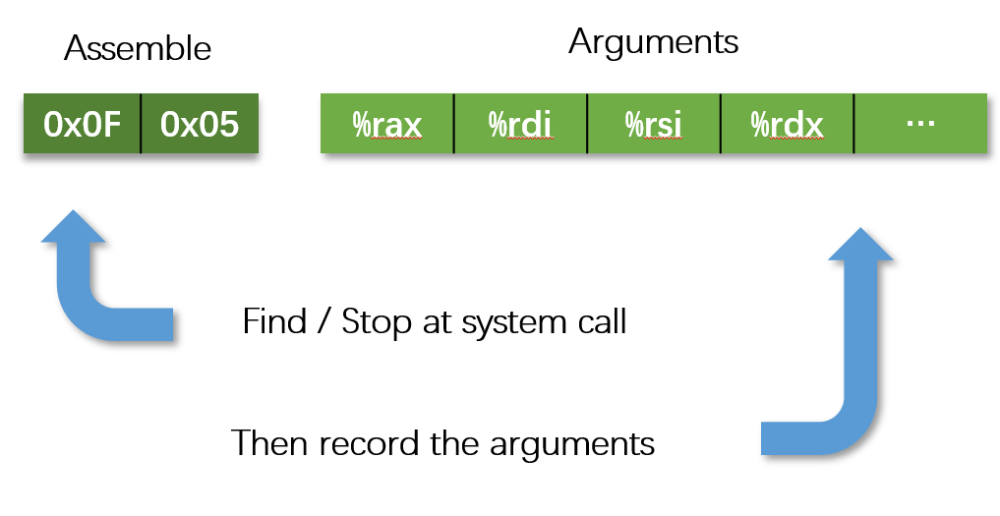
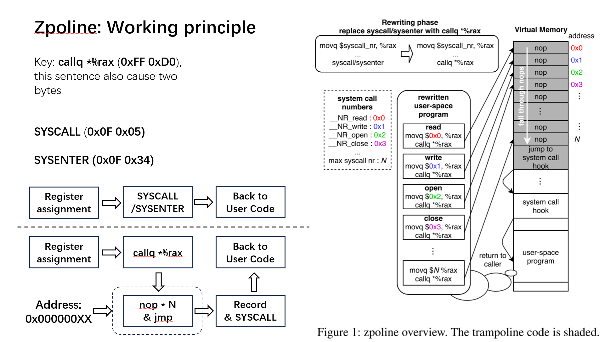
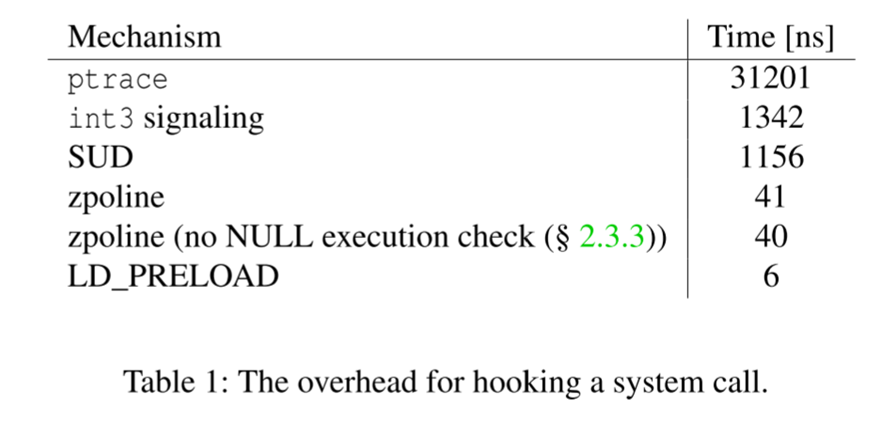

## **zpoline**: a system call hook mechanism based on binary rewriting

之前还在暑假实习时做的论文分享

### **system call hook**

一张图概括

 hook `0x0f 0x05` 再取后面的参数

如何 hook 呢？常规方法有用系统提供的，如：eBPF，Ptrace，Syscall User Dispatch (SUD)，LD_PRELOAD

也有改写指令的：int3 (0xCC) breakpoint，Syscall User Dispatch (SUD)

但是系统提供如 ptrace 往往有各种限制，改写 0xCC 的算上调试器又很慢，有没有更好的方法呢？

### Zpoline: 工作原理

用我 ppt 一张图概括

核心是把 `0x0f 0x05` 和 `0x0f 0x34` 两个系统调用代码转成了 `0xff 0xd0` callq 指令，再在 0 地址处 map 出一大块内存来滑雪橇划到 hook 代码

很显然，这个方式非常简单粗暴，但也非常好用。只需要提前 patch 好代码或者很少量的操作，就能实现性能表现非常良好的 system call 级别的 hook，因此，他的性能爆杀传统的 patch

但劣势也很明显，它只能应用于特定的架构，并且也有系统要求（部分系统不允许零地址操作）

并且他们并没有列出 eBPF，我感觉它应该是比这个好得多的，算是这个技术的完全上位，总的来说这个论文算是有点小技巧，但不多