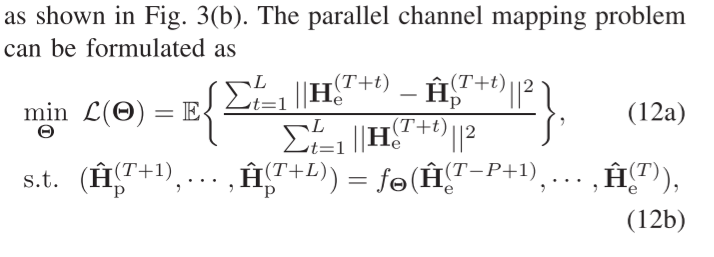
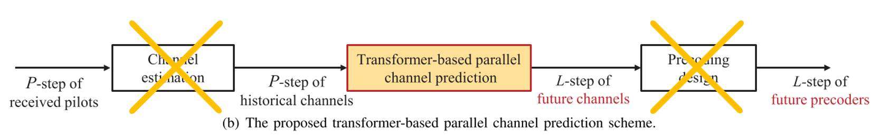
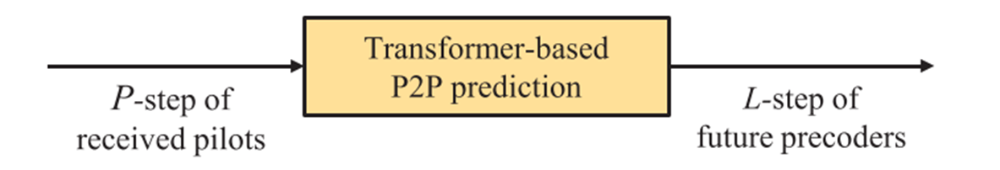
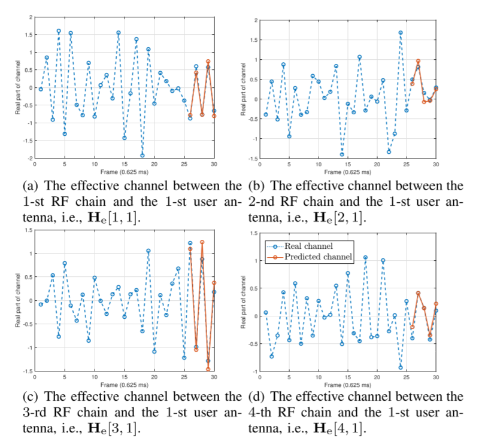
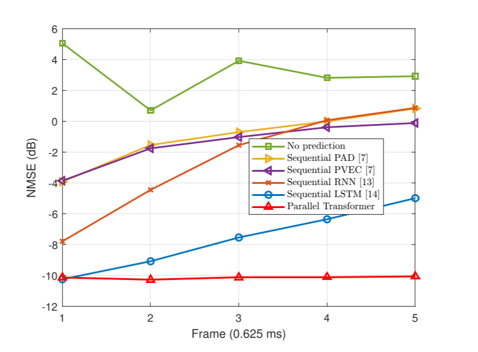
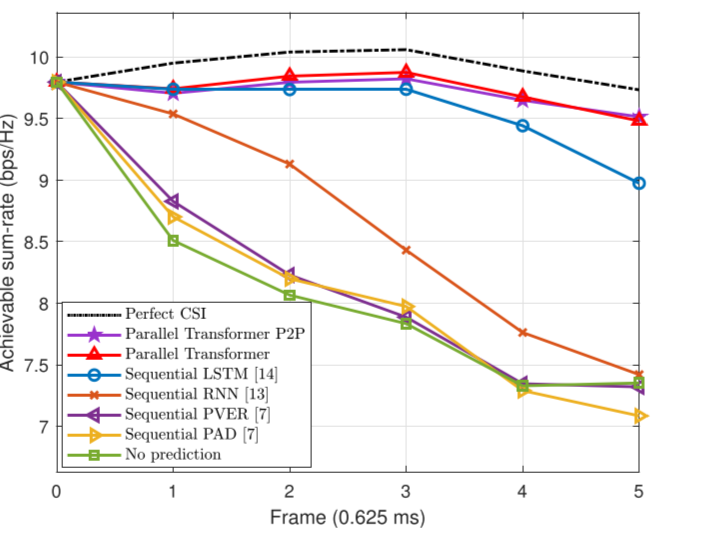
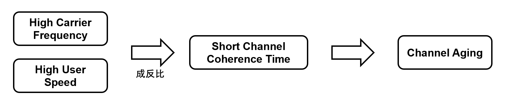
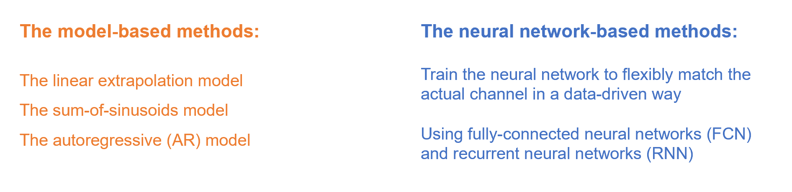

### 论文笔记：Accurate Channel Prediction Based on Transformer: Making Mobility Negligible (基于 transformer 的准确信道预测：消除运动产生的误差)

- #### 小总结

  - 为了解决由于高频信号的高速移动导致的**channel aging**, 很多人提出了不同的方法来解决。其中信道估计是其中较为热门的一个方向
  - 我们的作者在**神经网络的预测**（the neural network-based methods） 方向中发现了其大多数模型存在 error propagation problem, 于是他们选择使用 transformer 来改进模型
  - 以下为原论文结构分析以及总结

<!--more-->

- #### Abstract

  - 方向：Accurate **channel prediction** is vital to address the channel aging issue in mobile communications with fast time-varying channels.

  - 目前机器学习的传统方法是 sequentially predicted，会有 error propagation problem

  - 在方法上：我们提出了平行预测的方法，并且，使用了 attention 算法来选出更具代表性的数据，以此来更精准的预测（避免 error propagation problem）

  - 在复杂度上：我们提出了pilot-to-precoder (P2P) prediction scheme 来减少处理的系统复杂度

- #### Prior Work

  - 传统有两个类别： the model-based methods, and the neural network-based methods.

  - **model-based methods**

  	- such as the linear extrapolation model [7], [8], the sum-of-sinusoids model [9], and the
  	  autoregressive (AR) model [10], [11].  

  	- 但是 due to the multi-path effect and the Doppler effect, 这些方法会影响质量

  - **neural network-based channel prediction methods**

  	- 介绍了不同的 AI 网络，FCN,RNN, 用 historical channel 按时间顺序去预测未来

  	- As a result, to predict the channel in the second future frame, the predicted channel in the first future frame together with the historical channels have to be jointly served as the input of the trained RNN model for the next prediction.

  	- 结果，为了预测第二未来帧中的信道，必须将第一未来帧中预测的信道与历史信道一起作为用于下一预测的训练的RNN模型的输入。通过这种方式，随着时间的推移，只能一个接一个地预测接下来几帧中的未来信道。

  	- 然后这被称为  sequential channel, 顺序信道

  	- 感觉问题主要是在于未来的预测数据还用了预测的来跑，所以可靠性堪忧

  - 前面的问题

  	- prediction error propagation, 就是用 sequential prediction 去预测未来，造成误差传播

- #### Our work

  - 基于前面的顺序预测，我们整了个平行方法的预测，应该就是多个点映射

  - 在平行映射预测的基础上，整了个 attention 模块

  	- 这个有 map 和调整权重的作用，parallel mapping and weighting operation

  - pilot-to-precoder (P2P) prediction scheme

  	- 取消了 channel estimation 和 precoding design, 从而减少了系统复杂度

  	- 我猜是将这两个步骤直接去掉让模型自己搞定

- #### SYSTEM MODEL

  - massive MIMO system, single base station (BS) with NBS antennas serves a single user with M antennas.

  - Problem Formulation 问题转化：将信道预测问题转化为平行信道 mapping 映射的问题

  	- Since the channel is expected to vary rapidly over time due to the user mobility, using the channel estimated at the first slot for the remaining slots would cause a substantial loss of the achievable sumrate. Besides, the baseband processing delay also aggravates the channel aging issue [6].

  	- we formulate the channel prediction problem as a parallel channel mapping problem.

  		- 

  		- 过去的长度为 P 个帧，预测的为 L 个帧

  		- normalized MSE (NMSE) loss function 被使用

  - 在模型实现上用了注意力模块， 相当于选历史真实数据加权，生成更优的信号

  	- 这同时也能解决串行数据处理容易忘记早期输入的问题

  	- 一些参数意义

  		- n denotes the length of the input historical channels

  		- m denotes the feature dimension of each historical channel

  		- the key vector, the query vector, and the value vector, respectively K, Q, V

  		- K: key vector, Q: Query vector, V: Value vector

  		- Attention Matrix: E

  		- if K(key vector), query vector match better, the corresponding attention weight E would be larger

  - 章节 C：Encoder of Transformer Model

  	- attention mechanism + residual connection & lay normalization

  	- a two-layer FCN is considered to **further extract** and **synthesize features** of each
  	  historical input  

  - 章节 D： Decoder of Transformer Model

  	- 输入混合着后面的输出，用零填充

  	- 用掩码层掩盖零的部分

  	- 生成未来信号

  - 章节 E： 复杂度分析

  	- 太长不看

- #### TRANSFORMER-BASED PILOT-TO-PRECODER (P2P) PREDICTION 的实现

  - 因为：the channel estimation and precoding design may cause extremely high computational complexity.

  - 所以，他们去掉了**channel estimation and precoding design**

  - 相当于从  变成了 

  - 为什么：

  	- 由于个人的能力有限，关于复杂度的推导确实看的不大懂，个人感觉核心还是由我上面所说的是砍掉模块做到的这效果

  	- 而且这理由我也没看到，也不知道，应该是丢给 AI 黑盒跑就完了，你就说复杂度降没降嘛

- #### VI. SIMULATION RESULTS

  - 与真实数据比较的精度：

  - 

  - NMSE 性能 

  - 很吊，基本一条直线

  - 速率也很快 

- #### 个人在阅读该论文时初略了解的一些相关问题

  - 为什么会有信道老化 (channel aging)

  	- 

  	- 首先，先明白什么是 SRS:

  		- 在[5G](https://www.eefocus.com/tag/5G/) NR系统中，探测手机到基站上行信道状况的信号被称作SRS（Sounding Reference Signal，探测参考信号）信号，探测基站到手机下行信道的信号被称作CSI-RS（Channel State Information Reference Signal ，信道状态信息参考信号）信号。

  	- 但在高频和高速 (用户速度) 的情况下，信道相干时间会变短，这就导致了物理预测 (用第一个 slot 预测) 的方法失效，从而导致性能下降使得信道老化 (channel aging) 发生

  	- 物理上就是由于多普勒效应 (Doppler effect) 导致的 “The faster the user speed, the stronger the Doppler effect, and the smaller the channel coherence time. ”

  - 提到的信道预测 (channel prediction) 的两种类别

  	- 

  - Attention 模块包含什么？

  	- 这边用的是 self-attention，QKV 都是输入 x 矩阵变化得到的。用于预测

  	- 

  - 网络跳跃的作用

  	- https://blog.csdn.net/qq_41731861/article/details/120511148

  	- 如果仅对最后一层的特征图进行上采样得到原图大小的分割，最终的分割效果往往并不理想。因为最后一层的特征图太小，这意味着过多细节的丢失。因此，通过跳级结构将最后一层的预测（富有全局信息）和更浅层（富有局部信息）的预测结合起来，在遵守全局预测的同时进行局部预测。

  	- 将底层（stride 32）的预测（FCN-32s）进行2倍的上采样得到原尺寸的图像，并与从pool4层（stride 16）进行的预测融合起来（相加），这一部分的网络被称为FCN-16s。随后将这一部分的预测再进行一次2倍的上采样并与从pool3层得到的预测融合起来，这一部分的网络被称为FCN-8s。图示如下：

  - 为什么选 softmax 作为激活函数

  	- 第一点，相对于二分类用的 Sigmod，从二分类变到多分类，softmax 将为负无穷到真无穷的输入转化为（0，1），实现多个输出的功能

  	- 本质就是个求最大值的函数，但是为了能反向传播能求导，需要这个 softmax 设计好的数学函数映射

  	- softmax 相对于 hardmax 有更为优秀的选择空间，最重要的是复杂度低

  	- 最直接的是 self-attention 就用的这个

  - FCN 是什么，为什么选 two layer FCN

  	- Fully Convolutional Networks，FCN

  - 结果，模型性能要怎么看

  	- NMSE 

  	- 总的来说，NMSE 衡量了预测值与真实值之间的平均平方差，通过真实值的平方范围进行了归一化。较低的 NMSE 表示模型性能较好，理想情况下为 0。

  	- 用 db 比的话就是越低越好